# Лабораторная работа 1. Свой Docker

Задача была такая: не пользоваться Docker, а собрать его подобие руками. Взять обычный процесс, у которого нет никакой изоляции, и по одному навесить на него namespaces, cgroups и урезанные права. А потом честно сравнить то, что получилось, с настоящим `docker run`.

Работал в виртуалке с Ubuntu 24.04 под Hyper-V, ядро 6.8.0-139, cgroup v2. Сервис писал на Go 1.22.

Сразу скажу: самое интересное в этой лабе случилось не там, где всё получалось, а там, где не получалось. Ubuntu заблокировала то, что требовалось по заданию, замер производительности gVisor дал результат, противоположный ожидаемому, а cAdvisor отказался видеть контейнеры. Про каждый такой случай написал отдельно, потому что разбираться в них было полезнее, чем проходить по инструкции.

---

## Шаг 0. Подопытный сервис

Писать сервис смысла не было, он тут инструмент, а не цель. Сгенерировал HTTP-сервис `api` на Go с тремя эндпоинтами, каждый бьёт в свой механизм ядра.

| Эндпоинт | Что делает | Подо что |
|---|---|---|
| `GET /health` | отдаёт `ok` | проверка, что жив |
| `GET /eat?mb=N` | выделяет N мегабайт и держит | лимит памяти |
| `GET /burn` | занимает одно ядро вечным циклом | лимит CPU |

Один момент в коде оказался важным, и я понял это не сразу. Сервис не просто выделяет память, а **касается каждой страницы**:

```go
for i := 0; i < len(block); i += pageSize {
    block[i] = 1
}
```

<details><summary><b>Примечание: зачем касаться каждой страницы</b></summary>

Выделение памяти через `make` резервирует виртуальное адресное пространство, а физических страниц при этом не выделяется. Страница становится резидентной только когда в неё что-то записали, до этого она существует лишь как запись в таблице. Счётчик cgroup считает именно резидентные страницы, поэтому без записи в каждую страницу лимит памяти не пробить: `memory.current` просто не вырастет, сколько ни выделяй.

Шаг цикла равен размеру страницы (4096 байт). Писать в каждый байт избыточно, достаточно одного на страницу.
</details>

Собирается статикой, без cgo. Это пригодится на шаге 6, когда буду класть его в пустой образ.

---

## Шаг 1. Запускаю без изоляции

Это точка отсчёта. Дальше я буду по одному отбирать у процесса измерения свободы, и чтобы увидеть эффект, нужен снимок состояния «до».

| Параметр | Значение |
|---|---|
| PID на хосте | 7475 |
| Видно процессов (`ps -e`) | 129 |
| Имя хоста | `lab-docker` |
| Интерфейсы | `lo`, `eth0` (172.29.222.41/20), `docker0` |
| cgroup | `0::/user.slice/user-1000.slice/session-55.scope` |


### 1. Первое, что меня удивило

Процесс уже лежит в cgroup, хотя я никакой cgroup не создавал. `session-55.scope` создал `systemd-logind` под мою SSH-сессию. То есть **процессов вне cgroup не бывает**, вопрос только в том, что в этой cgroup написано.

А написано там ничего. Я дёрнул `/eat?mb=500` дважды, и процесс спокойно забрал гигабайт на машине, где `free` показывал меньше двух:

```
curl "localhost:8080/eat?mb=500"
ps -o pid,rss -p 7475     ->  7475  1030928   (это ~1007 МиБ)
```


Вывод для себя: принадлежность к cgroup сама по себе ничего не ограничивает. Лимит появляется только тогда, когда в интерфейсный файл записано значение.

### 2. Почему строка cgroup всего одна

Обратил внимание, что в `/proc/7475/cgroup` ровно одна строка и начинается она с `0::`.

<details><summary><b>Примечание: чем cgroup v2 отличается от v1</b></summary>

Формат строки трёхчастный: `иерархия:контроллеры:путь`. У меня `0::/user.slice/...`, то есть номер иерархии 0 и пустой список контроллеров. Это cgroup v2 с единым деревом.

В v1 здесь была бы пачка строк вида `12:memory:/user.slice`, `11:cpu,cpuacct:/user.slice`, по строке на иерархию, и в каждой явно назван контроллер.

Разница не косметическая. В v1 иерархии были независимы, и один процесс мог лежать в `memory:/foo` и одновременно в `cpu:/bar`, то есть в разных местах разных деревьев. Формально законно, на практике боль: «ограничить эту группу по памяти и CPU вместе» превращалось в ручную синхронизацию двух несвязанных деревьев. В v2 дерево одно, процесс в нём ровно в одном узле.
</details>

---

## Шаг 2. Namespaces

Шесть namespace я делал не разом, а по одному, иначе непонятно, что именно сработало. Итоговая команда собиралась постепенно, и к концу шага получилась такая:

```
unshare -U -r -p -f --mount-proc -u -i -n bash
```

### 1. pid и mount, и почему их нельзя по отдельности

Начал с PID namespace. Здесь есть ловушка, ради которой, видимо, задание и придумано: если взять только `unshare -p -f bash`, без `--mount-proc`, процесс станет PID 1, но `ps` продолжит показывать все 129 процессов хоста. Прежде чем собирать команду, разобрался, почему так.

`ps` не спрашивает ядро через какой-то специальный API, он **читает каталог `/proc`**. Проверил:

```
ls -d /proc/[0-9]* | wc -l    # совпадает с ps -e | wc -l
```

А `/proc` это смонтированная файловая система, и она привязана к тому PID namespace, в котором её монтировали. Хостовый экземпляр так и продолжает отдавать хостовую картину, мой новый namespace о нём ничего не знает.

Значит нужен свежий procfs, смонтированный уже изнутри. А монтирование трогает точки монтирования, то есть требует mount namespace, иначе я перемонтирую `/proc` всей машине. Вот почему pid и mount идут вместе.

```
sudo unshare -p -f --mount-proc bash

ps -e     ->  2 строки вместо 129
echo $$   ->  1
```

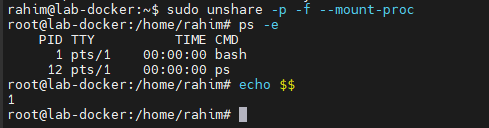

<details><summary><b>Примечание: зачем флаг -f</b></summary>

PID namespace не забирает к себе текущий процесс. Ядро не может поменять процессу PID на лету, слишком многое на него завязано. Новый namespace достаётся только детям, рождённым после `unshare`. Поэтому нужен `-f`: сначала `fork`, потом запуск. Без него получаешь namespace, в котором нет ни одного процесса, и невнятные ошибки вместо результата.
</details>

### 2. Один процесс, два номера

Запустил `api` внутри и нашёл его снаружи:

```
внутри:  pid 13
снаружи: pgrep -f './api'  ->  202363
```


Самое наглядное доказательство, что это один и тот же процесс, дало ядро само:

```
grep NSpid /proc/202363/status
NSpid:	202363	13
```


Ядро перечисляет номера процесса по всем namespace, которым он принадлежит: сначала хостовый, потом внутренний. Никакого противоречия между «PID 1» и «PID 202363» нет, это один процесс в двух системах нумерации.

### 3. Проверил, что хост не пострадал

Сравнил таблицы монтирования снаружи и внутри:

| Где | `wc -l /proc/self/mountinfo` |
|---|---|
| хост | 28 |
| внутри namespace | 29 |

Внутри на одну строку **больше**. Сначала подумал, что должно быть меньше, изоляция же. Оказалось наоборот: `unshare -m` не создаёт пустой список, он **копирует** хостовый целиком, а `--mount-proc` добавляет сверху свежий procfs. Старое монтирование `/proc` никуда не делось, оно под новым, затенено.

Отсюда и понятно, почему хост цел: списки монтирований у нас разные с самого начала, моя 29-я строка попала в копию.

### 4. uts и ipc

Эти два простые, добавил флаги `-u` и `-i`.

```
внутри:  hostname moy-container  ->  hostname выдаёт moy-container
снаружи: hostname                ->  lab-docker
```

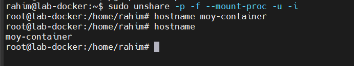
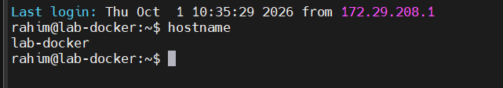

Заметил забавное: после смены имени приглашение шелла так и осталось старым. Потому что bash подставляет `\h` **один раз при старте** и дальше использует запомненное значение. Запустил вложенный `bash`, приглашение обновилось. Отсюда, кстати, понятно, почему в контейнерах приглашение сразу показывает хэш: шелл там стартует уже после того, как namespace создан.

С IPC проверял так: создал сегмент разделяемой памяти на хосте, посмотрел `ipcs -m` снаружи и внутри.

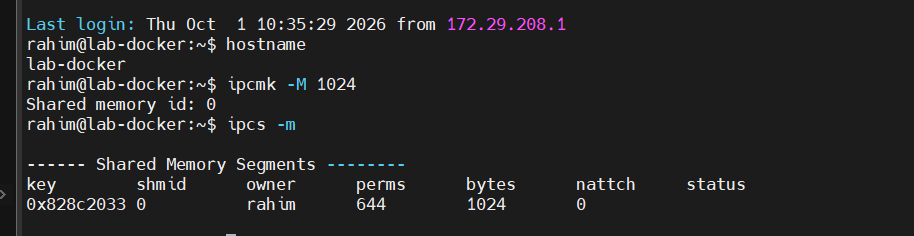
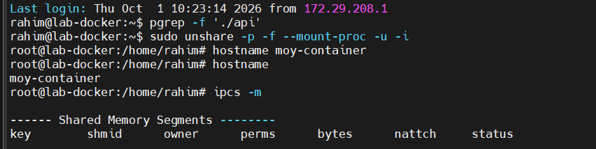

Потом создал сегмент **внутри**, и он получил `shmid 0`, ровно как хостовый. Но ключи разные (`0x828c2033` против `0xa59d63f3`), владельцы разные. Два независимых объекта с одинаковым номером.

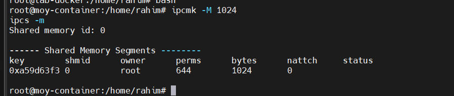

### 5. net: сеть есть, но бесполезная

Добавил `-n`. Внутри остался один интерфейс `lo`, и тот в состоянии `DOWN`.

```
ip -br addr                        ->  lo  DOWN
curl --max-time 5 http://1.1.1.1   ->  Failed to connect
ping -c1 172.29.208.1              ->  Network is unreachable
```


Обратил внимание, что `ping` ответил **мгновенно**, а не выждал таймаут. Посмотрел `ip route`, таблица пустая. Маршрутизация это ведь выбор исходящего интерфейса: ядро обязано решить, куда класть пакет, а решать не из чего. Поэтому `ENETUNREACH` возвращается локально, пакет вообще не создаётся.

Полезное различие, которое я для себя зафиксировал:

| Что видишь | Что произошло |
|---|---|
| `Network is unreachable` | маршрута нет, пакет не отправлялся |
| таймаут | пакет ушёл, ответа нет |
| `Connection refused` | пакет дошёл, никто не слушает |

Потом поднял петлю и запустил сервис внутри:

```
ip link set lo up
./api &
curl localhost:8080/health   ->  ok
```

А с хоста:

```
curl --max-time 5 172.29.222.41:8080/health   ->  Failed to connect after 0 ms
```


Проверил, почему. На хосте:

```
ss -ltnp | grep 8080   ->  пусто
```

А внутри тот же `ss` показывает `LISTEN *:8080 api`. Таблица слушающих сокетов своя у каждого сетевого namespace. Можно поднять хоть десяток контейнеров, и в каждом кто-то займёт 8080, не конфликтуя.

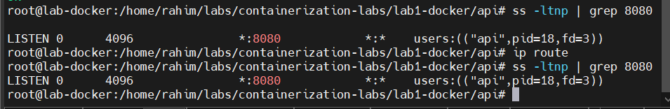

Вот тут до меня дошло, насколько много делает Docker: мой контейнер получил собственную сеть, и она изолирована до полной бесполезности. Чтобы до него достучаться, нужны veth-пара, бридж и NAT. `unshare` этого не делает.

### 6. user namespace и сюрприз от Ubuntu

Вот здесь лаба встала.

```
unshare -U -r bash
unshare: write failed /proc/self/uid_map: Operation not permitted
```

Namespace создался, а запись карты uid нет. Пошёл разбираться:

```
sysctl kernel.apparmor_restrict_unprivileged_userns   ->  1
```

<details><summary><b>Примечание: что сделала Canonical и почему</b></summary>

В обычном Linux непривилегированному пользователю разрешено отобразить собственный uid в любой внутренний, это безопасно и новых прав не даёт. Флаг `-r` пишет в `uid_map` строку `0 1000 1`, то есть «внутренний 0 это внешний 1000».

Ubuntu 24.04 ввела `kernel.apparmor_restrict_unprivileged_userns=1`: создание user namespace непривилегированным процессом теперь проходит через AppArmor, и если у бинарника нет профиля с разрешением `userns create`, namespace он получает **без capabilities**. Писать `uid_map` в таком namespace нельзя.

Мотив понятный: user namespaces открывают непривилегированному процессу путь к коду ядра (netfilter, файловые системы, сетевой стек), куда раньше пускали только root, и это крупнейший источник локальных повышений привилегий. Платой стали сломанные rootless-контейнеры и вот такие лабораторные.

Правильное решение вне учебной машины: не трогать глобальный sysctl, а выдать конкретному бинарнику профиль AppArmor с `userns create`. Я снял ограничение временно через `sysctl -w` и вернул обратно после экспериментов, потому что виртуалка одноразовая.
</details>

После снятия ограничения всё заработало:

```
unshare -U -r bash

внутри:  id                       ->  uid=0(root) gid=0(root) groups=0(root),65534(nogroup)
         cat /proc/self/uid_map   ->  0  1000  1
снаружи: ps -o pid,uid,user       ->  1000  rahim
```


То есть root и обычный пользователь одновременно, без противоречия. «Быть root» значит «иметь uid 0 в своём user namespace», а не какое-то абсолютное свойство.

В выводе `id` зацепился за `65534(nogroup)`. Это `overflowgid`, им ядро показывает всё, что не попало в карту отображения. Я отобразил один uid и один gid, остальные группы снаружи внутри просто не существуют.

И финал шага, все шесть namespace **без единого sudo**:

```
unshare -U -r -p -f --mount-proc -u -i -n bash
```


Причём `hostname` и `ip link set lo up` внутри прошли без sudo, хотя раньше требовали его. Каждый namespace принадлежит тому user namespace, из которого создан, значит для операций над ним достаточно capabilities в нём, а там у меня полный набор. Снаружи я при этом по-прежнему uid 1000. Это и есть принцип rootless-контейнеров.

### 7. Где изоляция протекает

Попробовал выполнить `sudo` внутри user namespace и получил:

```
sudo: /etc/sudo.conf is owned by uid 65534, should be 0
sudo: unable to open /etc/sudoers
```

Внутри я формально root, а половина системных утилит работать отказывается, потому что видит у файлов «неправильных» владельцев: внешний uid 0 в карту не попал и показывается как `nobody`. `sudo` считает это признаком подмены конфигурации и правильно делает.

Именно поэтому настоящие rootless-контейнеры отображают **диапазоны** uid через `/etc/subuid` и `/etc/subgid`, а не один идентификатор.

### 8. Что у всех шести общего

К концу шага заметил, что все шесть случаев устроены одинаково. PID, `shmid`, hostname, номер порта это **не глобальные адреса, а позиции в таблице, своей у каждого namespace**. Поэтому `NSpid: 202363 13` не противоречие: один процесс, две таблицы.

И второе: namespace **не строит стен**. Он меняет то, что процесс видит, а не то, к чему у него есть доступ. Нагляднее всего это вылезло с `/proc`.

---

## Шаг 3. Cgroups

Три лимита делал в трёх отдельных cgroup, чтобы эксперименты не влияли друг на друга.

<details><summary><b>Примечание: как задаются лимиты</b></summary>

У cgroups нет ни системных вызовов, ни API, весь интерфейс это файловая система. Лимит задаётся записью в файл:

```
echo "100M" > /sys/fs/cgroup/<путь>/memory.max
```

Процесс перемещается в группу так же, записью его PID в `cgroup.procs`.

Отдельно я разбирался, почему в новой cgroup может не оказаться файла `memory.max`. Какие контроллерные файлы появятся, определяет не сама cgroup, а её **родитель**. Цепочка идёт от `cgroup.subtree_control` родителя к `cgroup.controllers` ребёнка и дальше к набору файлов. Первый файл пишется, второй только читается.

Синтаксис записи особенный: множество изменяется поштучно, `+memory` добавить, `-memory` убрать. Голое `memory` ядро отвергнет.

Почему это право родителя, а не самой cgroup. Во-первых, каждый включённый контроллер стоит ядру структур учёта и работы на горячих путях, и делегат, включивший себе всё подряд на тысяче вложенных cgroup, испортил бы производительность всей машине. Во-вторых, родитель распределяет собственные ресурсы и только он вправе решать, что в поддереве подлежит учёту. Поэтому в systemd делегирование это явный флаг `Delegate=`, а не поведение по умолчанию.
</details>

### 1. Память и OOM

```
echo 100M | sudo tee /sys/fs/cgroup/lab-mem/memory.max
echo 0    | sudo tee /sys/fs/cgroup/lab-mem/memory.swap.max
```

`memory.swap.max=0` поставил явно, хотя swap в системе нет. При живом swap процесс под лимитом не умирает, а вытесняется в подкачку, и вместо честного OOM получается деградация производительности. По этой же причине Kubernetes долго запрещал swap на нодах.

`/eat?mb=50` прошёл штатно. `/eat?mb=200` оборвал соединение:

```
curl: (52) Empty reply from server
[1]+  Killed    ./api

memory.events:  max 37   oom 1   oom_kill 1

dmesg:
oom-kill:constraint=CONSTRAINT_MEMCG,oom_memcg=/lab-mem,task=api,pid=309798
Memory cgroup out of memory: Killed process 309798 (api) anon-rss:102784kB
```


Три вещи в этом выводе показались мне важными.

| Что в выводе | Что это значит |
|---|---|
| `max 37` | не 37 убийств, а счётчик попаданий в потолок |
| `anon-rss:102784kB` | ровно мои 100 МиБ, учтена резидентная анонимная память |
| `constraint=CONSTRAINT_MEMCG` | убийство пришло от cgroup, а не от глобального OOM-киллера |

Про `max 37` стоит пояснить. `memory.max` не убивает сразу: ядро сначала пытается **отобрать** память, сбросить кэш, вытеснить что можно. Тридцать семь раз оно освобождало место и давало процессу продолжить. Убийство пришло, когда отбирать стало нечего.

`anon-rss` подтверждает, что считается именно резидентная память, то есть то, ради чего сервис касается каждой страницы.

А `CONSTRAINT_MEMCG` самое важное слово в строке. Памяти в системе хватало с избытком, превышена была квота группы. Вот это буквально и есть `OOMKilled` в Kubernetes, без единого слоя абстракции сверху.

Ещё заметил `oom_group_kill 0`: убит только нарушитель. При `memory.oom.group=1` ядро снесло бы всю группу разом, так настраивают, когда процессы контейнера по отдельности бессмысленны.

### 2. CPU и throttling

```
echo "50000 100000" | sudo tee /sys/fs/cgroup/lab-cpu/cpu.max
```

Два числа в микросекундах: квота и период. 50 мс процессорного времени на каждые 100 мс реального, то есть пол-ядра. Именно так `limits.cpu: 500m` в Kubernetes превращается в настройку ядра, никакой другой магии там нет.

Снял два замера `cpu.stat` с интервалом в 3 секунды под `/burn`:

| Поле | Замер 1 | Замер 2 | Прирост |
|---|---|---|---|
| `nr_periods` | 776 | 806 | 30 |
| `nr_throttled` | 772 | 802 | 30 |
| `usage_usec` | 38 677 938 | 40 178 367 | 1 500 429 |


Проверил арифметику, и она сошлась красиво. 30 периодов за 3 секунды, значит период действительно 100 мс, и это видно из данных, а не из документации. Задросселированы все 30 из 30: `/burn` хочет целое ядро, получает половину, значит упирается в квоту каждый период. Прирост `usage_usec` ровно 1.5 секунды на 3 секунды реального времени, те самые 0.5 ядра.

Главное отличие от памяти в том, что процесс не убит и вообще не знает, что его ограничивают, он просто реже получает процессор. Память несжимаема: выдать 100 МиБ тому, кто просит 200, нельзя, можно только убить. Процессорное время сжимаемо: можно выдать меньше и растянуть во времени.

Отсюда, как я понимаю, и растёт практика ставить `requests` на CPU всем, а `limits` осторожно. Троттлинг режет выполнение кусками по 100 мс и портит хвосты латентности даже при невысокой средней загрузке.

### 3. pids.max против форк-бомбы

```
echo 20 | sudo tee /sys/fs/cgroup/lab-pids/pids.max
sudo bash -c 'echo $$ > /sys/fs/cgroup/lab-pids/cgroup.procs; exec stress-ng --fork 50 --timeout 10s'
```

`exec` здесь принципиален: он заменяет шелл на `stress-ng`, сохраняя PID и принадлежность к cgroup. Без него нагрузка ушла бы мимо группы.


```
pids.current:  20 из 20
pids.events:   max 232476
```


Двести тридцать две тысячи отклонённых `fork` за десять секунд. Ядро возвращало `EAGAIN` на каждый, группа не выросла выше 20 задач, а система при этом осталась полностью отзывчивой, я спокойно работал во втором окне.

Этот лимит, в отличие от двух предыдущих, защищает **хост от контейнера**, а не нарезает ресурсы. `memory.max` и `cpu.max` делят то, что есть, а `pids.max` закрывает классическую атаку на исчерпание таблицы процессов.

---

## Шаг 4. Права

### 1. Capabilities

Всемогущество root давно разобрано примерно на 40 отдельных возможностей. Docker по умолчанию оставляет контейнеру 14 из них.

Пробовал на смене системного времени. Трюк с установкой времени в его же текущее значение: операция привилегированная, а часы не сбиваются.

```
sudo date -s "$(date -R)"                                     ->  проходит
sudo capsh --drop=cap_sys_time -- -c 'date -s "$(date -R)"'   ->  Operation not permitted
```


Процесс после сброса по-прежнему uid 0 и по-прежнему «root», но конкретно эту операцию ядро ему больше не разрешает.

### 2. Ловушка, на которую я попался

Пробовал три способа сбросить capability, и один из них **не работает, хотя выглядит правильно**:

```
sudo capsh --caps="cap_net_admin-eip" -- -c 'ip link add dummy9 type dummy'
```

Выполняется без ошибок, не ругается, и команда спокойно создаёт интерфейс. Защиты нет.

<details><summary><b>Примечание: почему этот вариант не сработал</b></summary>

Разница между наборами capabilities. Bounding set ограничивает, что процесс **может приобрести**, effective set отвечает за то, что он **может прямо сейчас**. Я отобрал не тот набор, а проверить забыл, потому что ошибки не было.

Рабочие варианты оказались такие:

```
capsh --drop=cap_sys_time -- -c '...'
setpriv --bounding-set -sys_time --inh-caps -sys_time --reuid 0 --regid 0 --clear-groups ...
```

Вывод для себя: после сброса capability обязательно проверять, что привилегированная операция действительно перестала проходить. Отсутствие ошибки при сбросе ничего не доказывает.
</details>

### 3. Seccomp

Capabilities отвечают на вопрос «вправе ли процесс выполнять привилегированные операции». Seccomp отвечает на другой: «какие системные вызовы ему вообще доступны». Это другой слой.

Профиль написал точечный, поверх разрешающего действия по умолчанию ([seccomp/api-seccomp.json](seccomp/api-seccomp.json)):

```json
{
  "defaultAction": "SCMP_ACT_ALLOW",
  "syscalls": [
    {
      "names": ["chmod", "fchmod", "fchmodat", "mount", "umount2",
                "ptrace", "keyctl", "add_key", "request_key",
                "reboot", "kexec_load"],
      "action": "SCMP_ACT_ERRNO",
      "errnoRet": 1
    }
  ]
}
```

Выбирал так: HTTP-сервису на Go не нужно менять права файлов, монтировать, отлаживать чужие процессы, работать с ключами ядра или перезагружать машину. Ни один из этих вызовов в нормальной работе не встретится, а `mount`, `ptrace` и `keyctl` фигурируют в большинстве CVE про побег из контейнера.

```
docker run --rm alpine:3.20 sh -c 'touch /tmp/f && chmod 777 /tmp/f'
    ->  chmod прошёл

docker run --rm --security-opt seccomp=$PWD/seccomp/api-seccomp.json alpine:3.20 \
    sh -c 'touch /tmp/f && chmod 777 /tmp/f'
    ->  chmod: /tmp/f: Operation not permitted
```


Тут важно, что `chmod` на собственный файл в `/tmp` это операция **непривилегированная**, никаких capabilities для неё не нужно. Значит сбросом capabilities её не остановить в принципе, нечего сбрасывать. А seccomp режет вызов на входе в ядро, независимо от прав.

Вот и ответ на вопрос задания, что закрывает каждый механизм:

| Механизм | Что ограничивает | Чего не может |
|---|---|---|
| capabilities | привилегированные операции | непривилегированные вызовы, они вне его компетенции |
| seccomp | поверхность системных вызовов целиком | различать контекст, вызов запрещён всем и всегда |

В продакшене профиль делают наоборот, запрет по умолчанию и белый список. Надёжнее, но занимает сотни строк и для лабы нечитаем.

---

## Шаг 5. Собираю mydocker.sh

### 1. Порядок операций

Самым неочевидным оказался не состав команды, а последовательность:

```
cgroup -> лимиты -> членство ($$ в cgroup.procs) -> namespaces -> настройка -> сброс прав -> exec api
```

Три решения, которые определили эту структуру.

**Cgroup настраивается до запуска.** Иначе процесс успеет выделить память раньше, чем появится лимит.

**Членство записывается до `unshare`, а не после.** Я сначала думал, что придётся как-то ловить хостовый PID уже запущенного процесса. Проверил:

```
sudo bash -c 'echo $$ > /sys/fs/cgroup/cgtest/cgroup.procs; exec unshare -p -f --mount-proc bash -c "cat /proc/self/cgroup"'
    ->  0::/cgtest
```

Процесс унёс членство в cgroup с собой в новый namespace. Cgroups и namespaces ортогональны, смена namespace не меняет cgroup. Значит достаточно поместить в cgroup сам скрипт, и всё, что он породит, окажется там же. Как я понял, `runc` делает ровно так же.

**Права сбрасываются последними.** `hostname` и `ip link set lo up` внутри namespace требуют `CAP_SYS_ADMIN` и `CAP_NET_ADMIN`, а сервису на порту 8080 не нужно ничего. Поэтому сначала настройка, потом `setpriv` с обнулением всех наборов, и только затем `exec ./api`.

Два `exec` в цепочке не для красоты: каждый заменяет процесс вместо порождения нового, и в итоге `api` получает PID 1 внутри namespace, без промежуточных шеллов в дереве.

Скрипт целиком лежит в [mydocker.sh](mydocker.sh).

### 2. Результат


| Проверка | Значение |
|---|---|
| `/health` изнутри | `ok` |
| cgroup | `0::/mydocker` |
| `memory.max` | 268435456 (256 МиБ) |
| `cpu.max` | `50000 100000` |
| `pids.max` | 50 |
| uid процесса | 1000, при том что скрипт запущен от root |
| `CapEff`, `CapBnd` | `0000000000000000` |
| `NoNewPrivs` | 1 |
| `NSpid` | `565976  1` |

`CapEff: 0` меня порадовало: у процесса не осталось **ни одной** возможности из сорока. Плюс `NoNewPrivs=1` запрещает приобрести их обратно через setuid-бинарники.

### 3. Сравнение с docker run

Запустил эквивалент и сравнил построчно:

```
docker run -d --rm -m 256m --cpus 0.5 --pids-limit 50 alpine:3.20 sleep 300
```

Сначала namespaces. Список файлов в `/proc/<pid>/ns/` одинаков у всех процессов, поэтому сравнивал inode:

| namespace | Хост (pid 1) | Docker | `mydocker.sh` |
|---|---|---|---|
| pid, net, mnt, uts, ipc | базовые | свои | свои |
| **user** | ...1837 | ...1837, общий с хостом | ...1837, общий с хостом |
| **cgroup** | ...1835 | ...2223, свой | ...1835, общий с хостом |
| time | ...1834 | общий | общий |


Дальше права:

| Параметр | Docker | `mydocker.sh` |
|---|---|---|
| `CapEff` | `a80425fb`, 14 capabilities | `0`, ни одной |
| `NoNewPrivs` | 0 | 1 |
| `Seccomp` | 2, фильтр установлен | 0, фильтра нет |
| cgroup | `/system.slice/docker-<id>.scope` | `/mydocker` |


Маску Docker расшифровал:

```
capsh --decode=00000000a80425fb
cap_chown, cap_dac_override, cap_fowner, cap_fsetid, cap_kill, cap_setgid,
cap_setuid, cap_setpcap, cap_net_bind_service, cap_net_raw, cap_sys_chroot,
cap_mknod, cap_audit_write, cap_setfcap
```

**Что совпало.** Пять namespace, три лимита через cgroup v2, главный процесс как PID 1. По механике изоляции мой скрипт воспроизводит Docker один в один, потому что Docker и не делает ничего другого, он использует те же вызовы ядра.

**Чего я не ожидал.** User namespace не использует **ни тот, ни другой**. У Docker это умолчание, и не от лени: `--userns-remap` ломает совпадение uid между хостом и контейнером, а значит права на bind-mount томах, слои образов и доступ к сокетам. Вдобавок ремап в Docker один на весь демон, поэтому изоляции контейнеров друг от друга он всё равно не даёт.

Практическое следствие, которое я раньше знал как факт, а теперь понимаю механику: root в контейнере по умолчанию это **настоящий root хоста** с урезанными capabilities. Отсюда и опасность `--privileged`, он возвращает их обратно процессу, который уже uid 0 на хосте.

**Где мой скрипт строже.** По capabilities ноль против четырнадцати, плюс `NoNewPrivs=1`.

**Единственное место, где Docker изолирует больше**, это cgroup namespace. Проверил изнутри:

```
docker exec cmp cat /proc/self/cgroup   ->  0::/
изнутри mydocker                        ->  0::/mydocker
```


Контейнер Docker считает, что он в корне дерева, и не видит, где его разместили на хосте. Мой `api` знает полный путь и узнаёт кусочек топологии хоста. Утечка небольшая, но чинится одним флагом `-C` у `unshare`.

### 4. Чего в моём скрипте нет

| Чего нет | Почему и чем грозит |
|---|---|
| Корневая файловая система | процесс видит `/` хоста целиком; mount namespace изолирует список монтирований, но корень не подменяет, подменять не на что. Это задача образа, шаг 6 |
| Проброс портов | сервис внутри netns недостижим снаружи; нужны veth-пара, бридж и правила NAT, то есть половина сетевого стека Docker |
| Seccomp | накладывается системным вызовом, который процесс делает сам о себе до `exec`; из голого shell нечем, нужен код с libseccomp или `systemd-run` с `SystemCallFilter` |
| Cgroup namespace | контейнер видит полный путь `0::/mydocker` вместо `0::/` и узнаёт топологию хоста |
| Интеграция с systemd | Docker кладёт контейнеры в `system.slice`, поэтому systemd корректно останавливает их при выключении |

Про seccomp отмечу честно: на шаге 4 профиль я применял через Docker, а не своим скриптом, и это ограничение, а не недоработка оформления.

Сверх всего этого Docker делает кучу вещей, к механизмам ядра отношения не имеющих: получение и распаковка образов, слои и кэш сборки, перезапуски и healthcheck, сбор логов, именование и обнаружение контейнеров, настройка `/dev`, профиль AppArmor, ограничение устройств.

### 5. Побочное наблюдение про nsenter

Пытался посмотреть на cgroup глазами контейнера через `nsenter` и получил cgroup **своей SSH-сессии**, а не контейнера. `nsenter` переводит процесс между namespace, но членство в cgroup не меняет. Ещё одно подтверждение их ортогональности.

Для отладки это важно: процесс, запущенный через голый `nsenter`, оказывается **вне лимитов** контейнера. `docker exec` так не промахивается, он помещает процесс и в namespace, и в cgroup.

---

## Шаг 6. Образы

### 1. Два Dockerfile

Собрал один сервис двумя способами. Наивный ([Dockerfile.simple](Dockerfile.simple)) и multi-stage со `scratch` ([Dockerfile](Dockerfile)).

| Образ | Размер | Что внутри |
|---|---|---|
| `api:fat` | **1.32 ГБ** | весь тулчейн Go |
| `api:slim` | **6.89 МБ** | один слой на 4.79 МБ |


Разница почти **в 200 раз** при одном и том же сервисе. В `slim` три слоя, из них два чистые метаданные по 0 байт: `ENTRYPOINT` и `EXPOSE` пишутся в манифест образа и ничего не кладут в файловую систему.

Бинарник похудел с 6.7 МБ до 4.79 МБ за счёт `-ldflags="-s -w"`, выброшены таблица символов и отладочная информация.

`FROM scratch` работает только потому, что сборка идёт с `CGO_ENABLED=0` и бинарник статически слинкован. Был бы хоть один вызов в libc через cgo, образ бы не запустился, причём без внятной ошибки: в `scratch` нет ни динамического загрузчика, ни шелла, чтобы об этом сообщить.


Главный аргумент за `scratch` для меня оказался не размер, а поверхность атаки. В `fat` лежит компилятор Go, исходники стандартной библиотеки и полноценный Debian с `apt`, `curl` и `bash`, то есть попавший внутрь получает рабочую среду. В `scratch` выполнять нечего, кроме самого сервиса.

### 2. Кэш BuildKit и почему touch его не ломает

Хотел показать, как ломается кэш, сделал `touch api/main.go`, пересобрал и получил **сплошные `CACHED`**.


Разобрался: BuildKit считает **контрольную сумму содержимого**, а не время модификации. Старый классический билдер сравнивал файлы по mtime и размеру, и `touch` его обманывал. BuildKit перечитал контекст (`transferring context` вырос с 85 B до 3.23 kB), но хеш совпал, и ни один слой не пересобрался.

Реальное изменение содержимого ломает кэш там, где и задумано:

```
CACHED [build 2/6] WORKDIR /src
CACHED [build 3/6] COPY api/go.mod ./
CACHED [build 4/6] RUN go mod download     <- зависимости не перекачивались
       [build 5/6] COPY api/*.go ./        <- отсюда пересборка
       [build 6/6] RUN go build ...
```


Ради этого `go.mod` и копируется отдельной инструкцией до исходников: слой с зависимостями живёт своей жизнью, и правка кода его не трогает. Скопируешь всё одним `COPY`, и каждая правка `main.go` будет заново тянуть модули.

### 3. Слой записи эфемерен

Записал файл в контейнер, пересоздал контейнер:

```
docker exec eph sh -c 'echo "важные данные" > /state.txt'
docker rm -f eph && docker run -d --name eph alpine:3.20 sleep 300
docker exec eph cat /state.txt   ->  can't open '/state.txt': No such file or directory
```


С именованным томом те же данные остались:


Потом полез смотреть, где это физически лежит, и напоролся на ещё одну версионную особенность.

<details><summary><b>Примечание: GraphDriver.Data больше не работает</b></summary>

Везде в инструкциях пишут смотреть так:

```
docker inspect -f '{{.GraphDriver.Data.UpperDir}}' <container>
```

У меня это выдало `map has no entry for key "GraphDriver"`. Оказалось, Docker 29 использует containerd snapshotter (`driver-type: io.containerd.snapshotter.v1`), а поле `GraphDriver.Data` принадлежало старому механизму хранения и теперь пустое. Слои при этом переехали из `/var/lib/docker/overlay2/` в `/var/lib/containerd/...`.

Надёжнее брать данные из первоисточника, то есть из таблицы монтирований процесса контейнера:

```
CPID=$(docker inspect -f '{{.State.Pid}}' <container>)
sudo awk '$5=="/" && /overlay/' /proc/$CPID/mountinfo | tr ',' '\n' | sed -n 's/^upperdir=//p'
```
</details>

```
UpperDir: /var/lib/containerd/io.containerd.snapshotter.v1.overlayfs/snapshots/59/fs
          └── layer.txt   "в слое записи"
Том:      /var/lib/docker/volumes/labdata/_data
```


Корень контейнера собран overlayfs из трёх частей:

| Часть | Что это |
|---|---|
| `lowerdir` | слои образа, смонтированные только для чтения |
| `upperdir` | единственный записываемый слой поверх них |
| `workdir` | служебная область для атомарных операций |

Запись в существующий файл вызывает copy-up: файл копируется из нижнего слоя в верхний, и правится уже копия.

Отсюда и эфемерность: `docker rm` удаляет `upperdir`, слои образа остаются и переиспользуются другими контейнерами. Том лежит отдельно, вне overlayfs и вне жизненного цикла контейнера.

---

## Шаг 7. Когда контейнера мало: gVisor

### 1. Чьё ядро отвечает

Поставил `runsc`, зарегистрировал как рантайм Docker.

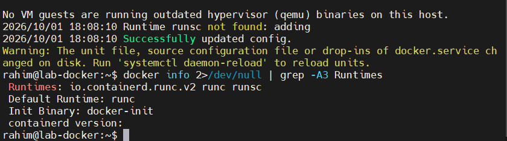

```
runc:  Linux version 6.8.0-139-generic (buildd@lcy02-amd64-036) ... Ubuntu
runsc: Linux version 4.19.0-gvisor #1 SMP Sun Jan 10 15:06:54 PST 2016
```

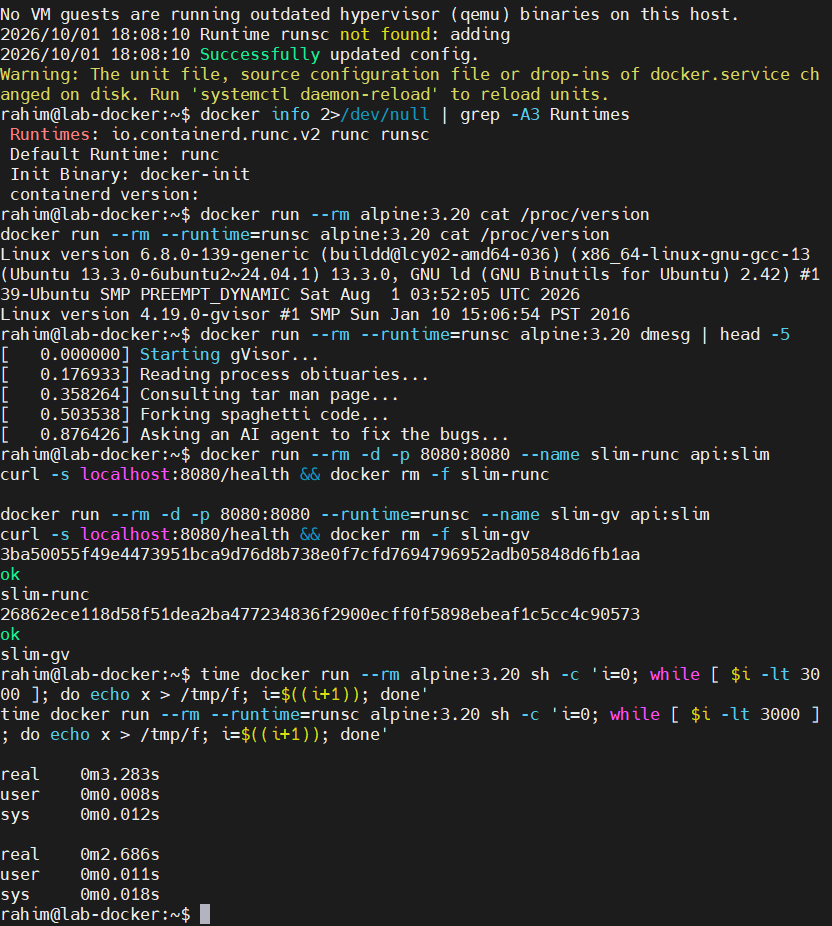

Под `runc` контейнер видит **настоящее ядро хоста**, ту же строку, что `uname` на самой машине. Под `runsc` отвечает Sentry и сообщает фиксированную версию 4.19 независимо от хоста. Это не косметика: приложение видит API ядра 2016 года, и свежие системные вызовы в gVisor просто не реализованы. Отсюда, как я понял, значительная часть проблем совместимости.

`dmesg` под gVisor выдал собственный шуточный загрузочный лог («Reading process obituaries», «Forking spaghetti code»). Шутка содержательная: Sentry **сам его генерирует**, потому что он и есть ядро для этого контейнера. Под обычным Docker `dmesg` либо запрещён, либо показывает хостовый лог, то есть прямую утечку с хоста.

### 2. Два замера, которые противоречат друг другу

Первый замер, цикл с записью в `/tmp`, 3000 итераций:

| Рантайм | Время |
|---|---|
| runc | 3.28 s |
| runsc | **2.69 s** |

gVisor оказался **быстрее**, чего я совершенно не ожидал. Разобрался: тест упирался не в системные вызовы, а в файловую систему. Под `runc` каждая запись шла через overlayfs на диск, а под gVisor `/tmp` обслуживает **внутренняя tmpfs самого Sentry**, запись не доходит до хостового ядра и остаётся в памяти процесса. Я сравнивал диск с памятью, а не обычный syscall с перехваченным.

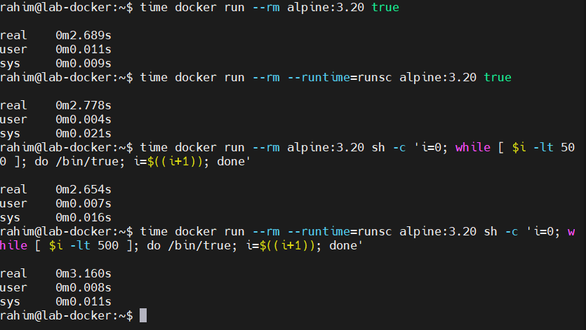

Переделал: 2000 раз `fork` плюс `exec`, с измерением **изнутри** контейнера, чтобы исключить примерно 2.7 с на его запуск.

| | runc | runsc |
|---|---|---|
| `real` | **0.43 s** | **2.65 s** |
| `user` | 0.31 s | 1.64 s |
| `sys` | 0.12 s | 1.40 s |

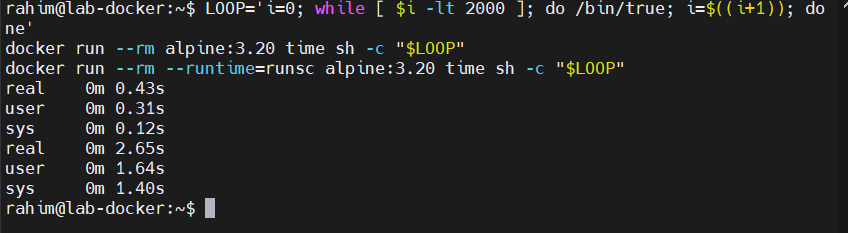

Замедление **в 6.2 раза**, около 1.3 мс на запуск процесса против 0.2 мс.

Попутно заметил: под `runsc` сумма `user` и `sys` (3.04 s) больше `real` (2.65 s), значит работа шла параллельно в нескольких потоках, это Sentry обслуживает перехваченные вызовы своими горутинами. Под `runc` сумма совпадает с `real`.

Главный вывод для себя тут методический, а не про цифры. **Два замера одной и той же пары рантаймов дали противоположные ответы**, потому что нагружали разные пути. Накладные расходы gVisor пропорциональны тому, как часто контейнер обращается к хостовому ядру. Утверждение «gVisor медленнее на N процентов» без указания профиля нагрузки не значит ничего.

### 3. Чем gVisor устроен иначе

Обычный контейнер делает системный вызов, и его обрабатывает ядро хоста, тот же самый код, что обслуживает все остальные процессы машины. gVisor вклинивается в этот путь: вызов перехватывается и попадает в **Sentry**, реализацию интерфейса Linux в пространстве пользователя на Go. Большинство вызовов Sentry обслуживает сам, и лишь узкий набор доводит до настоящего ядра, да и то через отдельный ограниченный процесс `Gofer` для файловых операций.

Безопасность растёт не потому, что Sentry надёжнее ядра, а потому что **меняется цель атаки**. Контейнер больше не разговаривает с ядром напрямую: он атакует Sentry, а успешная атака оставляет его внутри обычного процесса с урезанными правами, под seccomp-фильтром, которым Sentry ограничивает сам себя.

### 4. Что остаётся общим с хостом в любом случае

Это, по-моему, главный вопрос всей лабораторной, и ответ на него складывался постепенно из каждого шага.

Namespaces меняют то, что процесс видит. Cgroups ограничивают, сколько он потребляет. Capabilities и seccomp сужают то, что ему позволено. Но все эти механизмы работают **внутри одного ядра**, и системные вызовы контейнера обрабатывает ровно тот же код, что и вызовы хоста.

Отсюда предел: уязвимость в обработчике любого системного вызова это побег из контейнера, сколько механизмов изоляции сверху ни навешивай. Именно поэтому seccomp настолько ценен. Он не добавляет изоляции как таковой, он **сокращает объём кода ядра**, до которого контейнер способен дотянуться.

И с gVisor общее с хостом никуда не исчезает полностью:

| Что остаётся общим | Чем это грозит |
|---|---|
| то же железо | те же кеши процессора, а значит побочные каналы вроде Spectre |
| тот же планировщик хоста | Sentry это обычные процессы, конкурирующие за те же ядра |
| всё то же хостовое ядро под Sentry | поверхность узкая, но не нулевая |

Полная изоляция означает **отдельное ядро**, то есть виртуальную машину. Этим путём идут Firecracker и Kata Containers: лёгкая VM со своим ядром, запускаемая за десятки миллисекунд. Это уже не контейнеры, и цена другая, зато граница проходит там, где её гарантирует процессор, а не код в общем ядре.

---

## Шаг 8. Мониторинг

### 1. Стек и откуда берутся метрики

Поднял через [compose](../monitoring/compose.yaml): cAdvisor, Prometheus, Grafana. Положил на верхний уровень репозитория, а не внутрь лабы: это отдельный стек, он не часть подопытного сервиса. Переиспользовать его дальше, впрочем, не вышло, во второй лабе мониторинг пришлось собирать заново уже под Kubernetes.

Самое интересное для меня здесь было в том, что никакого отдельного механизма сбора метрик контейнеров в ядре нет. cAdvisor монтирует внутрь себя `/sys` и читает **те же самые файлы cgroup**, в которые я вручную писал лимиты на шаге 3:

| Файл cgroup | Метрика |
|---|---|
| `memory.current` | `container_memory_usage_bytes` |
| `memory.max` | `container_spec_memory_limit_bytes` |
| `cpu.stat`, поля `nr_throttled` и `nr_periods` | `container_cpu_cfs_throttled_periods_total`, `container_cpu_cfs_periods_total` |
| `memory.events`, поле `oom_kill` | `container_oom_events_total` |

Весь мониторинг контейнеров это чтение cgroup и перекладывание чисел в формат Prometheus.

`scrape_interval` снизил с 15 до 5 секунд: нагрузка в лабе короткая и всплесками, при редком опросе троттлинг не попадает в выборку и дашборд показывает ровную линию там, где был пик.

### 2. Две проблемы при настройке

**cAdvisor не видел имён контейнеров.** Метрики приходили, но только с меткой `id` (путь cgroup), без имён и образов. В логе нашлось:

```
Registration of the docker container factory failed:
client version 1.41 is too old. Minimum supported API version is 1.44
```

cAdvisor v0.49.1 говорит с Docker по API 1.41, а Docker 29 требует минимум 1.44, рукопожатие не состоялось. Решилось обновлением до v0.55.1 и `DOCKER_API_VERSION=1.44`.

По дороге я пробовал задать `--containerd-namespace=moby`, и метрики действительно появились, но метаданные брались от containerd-фабрики, и в метку `name` попадал идентификатор контейнера вместо имени. После починки Docker-фабрики флаг убрал.

**Дубли в легендах.** Каждая панель рисовала по две записи `api-mon`. Оказалось, Grafana по умолчанию выполняет запрос в режиме `Both`, то есть и как диапазон, и как мгновенное значение. Отсюда и вторая запись, и жёлтая точка в конце каждого графика. Исправил переводом запросов в режим `Range`.

Ещё пришлось обернуть все запросы в `max by (name)`: при пересоздании контейнера появляется второй ряд с тем же `name`, но другим `id`, и графики двоятся.

### 3. Дашборд

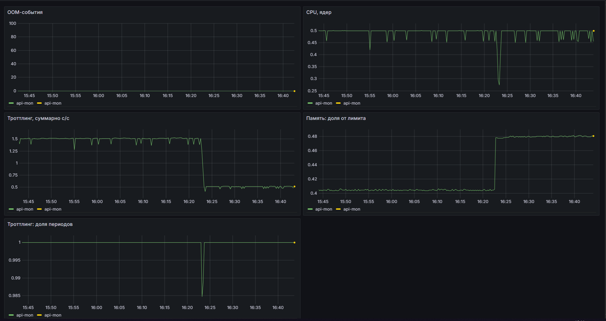

Экспортировал в [lab1-container-resources.json](../monitoring/grafana/dashboards/lab1-container-resources.json), чтобы воспроизводился из файла, а не жил только в браузере.

Пять панелей: память как доля от лимита, CPU в ядрах, доля задросселированных периодов, суммарное время в троттлинге, OOM-события.

Главное наблюдение по дашборду: **панель CPU показывает ровные 0.5 ядра, а панель троттлинга 100% задросселированных периодов.** По графику загрузки это выглядит как уверенная работа на половине ядра, и без отдельной панели никто бы не догадался, что сервису постоянно не хватает процессора. Вот это для меня и есть аргумент, почему троттлинг нужен самостоятельной метрикой, а не выводится из загрузки.

Отдельно про выбор метрики памяти. Взял `working_set`, а не `usage`.

<details><summary><b>Примечание: чем working_set отличается от usage</b></summary>

`usage` включает страничный кэш, который ядро отдаст под давлением без вреда для процесса. `working_set` это то, что реально нельзя отобрать.

Решение об OOM ядро принимает именно по `working_set`, поэтому алерт по `usage` регулярно срабатывал бы на безобидном кэше. На дашборде и в алертах использую `working_set`.
</details>

Метрика `container_processes` для Docker-контейнеров не экспортируется, поэтому `pids` на дашборд не попал.

### 4. Три метрики под алерты

Выбирал так, чтобы получилась лестница: опережающий сигнал, деградация, свершившийся факт. Три метрики про одно и то же оставили бы слепые зоны.

| Метрика | Порог | Роль |
|---|---|---|
| Память как доля от лимита | > 90% за 5 минут | опережающий сигнал |
| Доля задросселированных периодов CPU | > 25% за 10 минут | деградация |
| Перезапуски контейнера | не меньше 3 за 10 минут | свершившийся факт |

**1. Память как доля от лимита** (`working_set / limit`), порог **> 90% в течение 5 минут**

Ловит приближение к лимиту: утечку, рост кэша, всплеск нагрузки. Грозит OOM-kill и рестартом. Ценность в опережающем характере: алерт срабатывает до убийства процесса, остаётся время поднять лимит или найти утечку.

Ограничение, которое я понимаю и фиксирую честно: резкий всплеск может пробить лимит быстрее, чем отработает пятиминутное окно. На шаге 3 запрос `/eat?mb=200` при лимите 100 МиБ убил процесс мгновенно, такой сценарий этот алерт не поймает в принципе.

**2. Доля задросселированных периодов CPU** (`throttled_periods / periods`), порог **> 25% за 10 минут**

Ловит нехватку квоты: CFS регулярно останавливает контейнер, даже когда средняя загрузка выглядит нормальной. Грозит ростом латентности, таймаутами и проваленными liveness и readiness пробами. Снаружи сервис кажется медленным, хотя не падает и по памяти в норме.

Порог тут неотделим от профиля сервиса, и это важно оговорить. На моём стенде `api-mon` под `/burn` держит 100% троттлинга непрерывно, и с таким порогом алерт горел бы постоянно. Для пакетной обработки упор в квоту это штатный режим, для API с SLA по задержке авария. Значение 25% имеет смысл только для второго случая.

**3. Перезапуски контейнера** (`changes(container_start_time_seconds[10m])`), порог **не меньше 3 за 10 минут**

Ловит цикл падений по любой причине: OOM, ошибка в коде, неверный конфиг, падающие пробы. Грозит фактической недоступностью сервиса.

Это запаздывающий сигнал, он сообщает о том, что уже сломалось. В этой роли он и нужен: покрывает причины, которых первые две метрики не видят вовсе.

**Чего не взял и почему.** `container_oom_events_total` отдельным алертом не стал брать: перезапуски его поглощают, а дублирующий сигнал об одном событии только добавляет шума. Абсолютное потребление CPU в ядрах оставил на дашборде, но не в алертах: само по себе число ядер ничего не говорит о проблеме, значение имеет отношение к квоте, а его лучше ловит троттлинг.

---

## Вывод

Самым полезным в этой лабораторной оказалось не то, что всё получилось, а то, где и как не получалось. Ubuntu 24.04 заблокировала user namespaces и заставила разобраться, зачем Canonical на это пошла. Первый замер gVisor дал результат, противоположный ожидаемому, и пришлось понять, что бенчмарк измеряет то, чем его нагружаешь, а не то, что ты хотел померить. `capsh --caps` молча ничего не заблокировал и научил проверять результат, а не отсутствие ошибки. cAdvisor отказался видеть контейнеры из-за рассогласования версий API.

Главное, что у меня сложилось: **контейнер это не объект, а процесс с ограниченным взглядом на систему**. Отдельной сущности «контейнер» в ядре нет, есть комбинация трёх независимых механизмов, каждый из которых прекрасно работает и без остальных. Я запускал процесс в namespaces без единого лимита и вешал cgroup на обычный процесс на хосте, ядру всё равно, это Docker склеивает их вместе.

И второе: номер или имя что-то значат только внутри своего пространства. PID, shmid, hostname, номер порта, везде одно устройство, и `NSpid: 202363 13` перестал казаться странным.

Собрать свой `mydocker.sh` оказалось не так сложно, как я ожидал. Сложнее было понять, **чего в нём нет** и почему Docker это делает. Список получился длинный, и половина пунктов к изоляции отношения не имеет вовсе.
