# Лаба 1 — Свой Docker

Язык сервиса: **Go 1.22**. Среда: Ubuntu 24.04 (ядро 6.8.0-139), Hyper-V, cgroup v2.

Подопытный сервис — [`api/`](api/): `GET /health`, `GET /eat?mb=N` (выделяет и удерживает N МиБ), `GET /burn` (занимает одно ядро).

---

## Часть 1 — Запуск напрямую

Точка отсчёта: процесс без какой-либо изоляции.

| Параметр | Значение |
|---|---|
| PID на хосте | 7475 |
| Видно процессов (`ps -e`) | 129 |
| Имя хоста | `lab-docker` |
| Интерфейсы | `lo`, `eth0` (172.29.222.41/20), `docker0` |
| cgroup | `0::/user.slice/user-1000.slice/session-55.scope` |
| RSS после двух `/eat?mb=500` | ~1007 МиБ, ограничений нет |

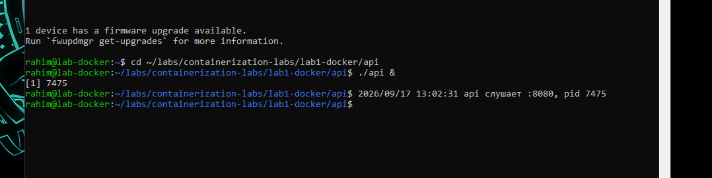
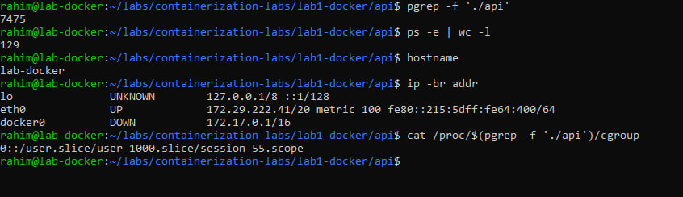
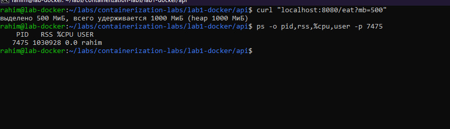

Два вывода:

1. **Процессов «вне cgroup» не бывает.** Сервис попал в `session-55.scope` ещё до того, как я о cgroup задумался — scope создал `systemd-logind` под SSH-сессию. Одна строка с префиксом `0::` означает cgroup v2 с единым деревом; в v1 здесь была бы строка на каждую иерархию, и пути в них могли не совпадать.
2. **Принадлежность к cgroup ничего не ограничивает.** Лимит появляется только записью в интерфейсный файл (`memory.max` и подобные). Никакого API у cgroups нет — весь интерфейс это файловая система.

---

## Часть 2 — namespaces

Команда, собранная по ходу работы:

```bash
unshare -U -r -p -f --mount-proc -u -i -n bash
```

| namespace | Что изолировал | Доказательство |
|---|---|---|
| **pid** | нумерацию процессов | внутри `ps -e` — 2 строки вместо 129, `echo $$` → 1; снаружи тот же процесс под PID 202363 |
| **mount** | список точек монтирования | `/proc/self/mountinfo`: 29 строк внутри против 28 на хосте — свежий procfs лёг поверх старого, хост не затронут |
| **net** | сетевой стек целиком | внутри только `lo` в состоянии `DOWN`; `ping` → `Network is unreachable`; `ss` на хосте не видит слушающий `:8080` |
| **uts** | имя хоста | внутри `moy-container`, снаружи `lab-docker` |
| **ipc** | объекты System V IPC | `ipcs -m` внутри пуст; созданный внутри сегмент получил `shmid 0` — как и хостовый, но это два разных объекта с разными ключами |
| **user** | отображение uid/gid | внутри `uid=0(root)`, снаружи тот же процесс под `uid 1000`; `/proc/self/uid_map` → `0 1000 1` |

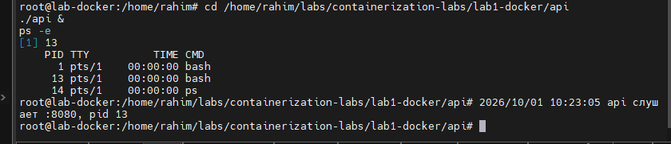
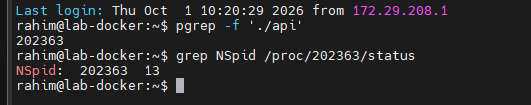
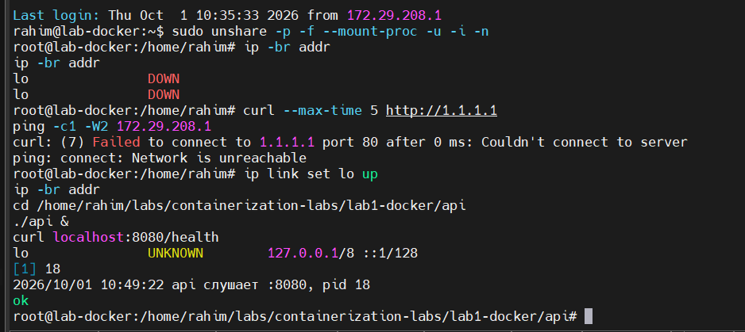
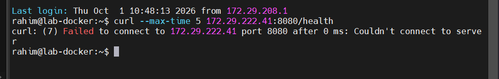
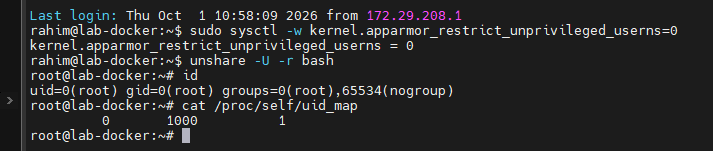
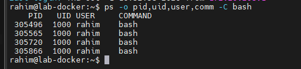
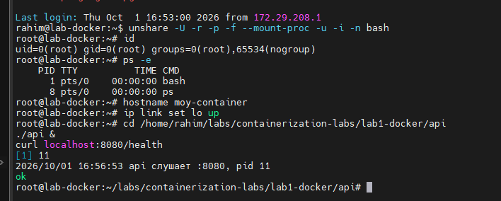

### Общий принцип

Все шесть случаев устроены одинаково: **номер или имя что-то значит только внутри своего пространства имён.** PID, `shmid`, hostname, номер порта — это не глобальные адреса, а позиции в таблице, своей у каждого namespace. Поэтому `NSpid: 202363 13` не противоречие: один процесс, две таблицы, два номера.

Отсюда же следует, что namespace **не строит стен**. Он меняет то, что процесс видит, а не то, к чему он имеет доступ. Нагляднее всего это проявилось с `/proc`: PID namespace сам по себе не скрывает чужие процессы, потому что `ps` читает смонтированную файловую систему, привязанную к тому namespace, в котором её смонтировали. Без свежего procfs внутри `ps` продолжает показывать все 129 процессов хоста.

### Ловушка PID 1

При выходе из изолированного шелла запущенный внутри `api` исчез, хотя его никто не останавливал. Когда PID 1 namespace завершается, ядро рассылает `SIGKILL` всем оставшимся процессам и уничтожает namespace. Та же логика объясняет, почему `docker stop` часто ждёт все десять секунд: у PID 1 иммунитет к сигналам без явного обработчика, `SIGTERM` просто отбрасывается, и дело заканчивается `SIGKILL` по таймауту.

### Находка: Ubuntu 24.04 блокирует непривилегированные user namespaces

Запуск `unshare -U -r` от обычного пользователя не прошёл:

```
unshare: write failed /proc/self/uid_map: Operation not permitted
```

Причина — `kernel.apparmor_restrict_unprivileged_userns=1`. Namespace создаётся, но без capabilities, поэтому запись карты uid запрещена. Canonical закрыла этот путь осознанно: user namespaces дают непривилегированному процессу доступ к коду ядра, куда раньше пускали только root, и это крупный источник локальных повышений привилегий.

Для лабы ограничение снималось временно через `sysctl -w` и возвращалось обратно. Правильное решение вне учебной машины — не трогать глобальный `sysctl`, а выдать конкретному бинарнику профиль AppArmor с разрешением `userns create`.

### Где изоляция протекает

Попытка выполнить `sudo` внутри user namespace закончилась отказом: `/etc/sudo.conf is owned by uid 65534, should be 0`. В карте отображён единственный uid, все остальные владельцы показываются как `overflowuid` (65534, `nobody`). Формально внутри ты root, фактически часть системных утилит работать отказывается. Именно поэтому настоящие rootless-контейнеры отображают диапазоны uid через `/etc/subuid` и `/etc/subgid`, а не один-единственный идентификатор.

---

## Часть 3 — cgroups

Три лимита, три отдельные cgroup. Процесс перемещается в группу записью его PID в `cgroup.procs` — тем же способом «записать в файл», что и всё остальное в cgroup v2.

### Память и OOM

```bash
echo 100M | sudo tee /sys/fs/cgroup/lab-mem/memory.max
echo 0    | sudo tee /sys/fs/cgroup/lab-mem/memory.swap.max
```

`memory.swap.max=0` задан явно: при живом swap процесс под лимитом не умирает, а вытесняется в подкачку, и вместо честного OOM получается деградация. По этой же причине Kubernetes долго запрещал swap на нодах.

`/eat?mb=50` отработал штатно. `/eat?mb=200` оборвал соединение — процесс убит.

```
memory.events:  max 37   oom 1   oom_kill 1
dmesg: oom-kill:constraint=CONSTRAINT_MEMCG,oom_memcg=/lab-mem,task=api,pid=309798
       Memory cgroup out of memory: Killed process 309798 (api) anon-rss:102784kB
```

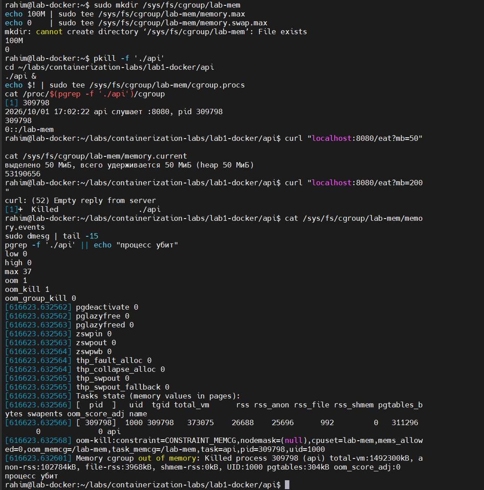

Три детали из вывода:

- **`max 37`** — столько раз выделение упёрлось в потолок. `memory.max` не убивает сразу: сперва ядро пытается отобрать память (сбросить кэш, вытеснить что можно). OOM приходит, только когда отбирать больше нечего.
- **`anon-rss:102784kB`** — ровно заданные 100 МиБ. Учитывается резидентная анонимная память, поэтому сервис намеренно касается каждой страницы: без записи в страницу она не станет резидентной и в счётчик не попадёт.
- **`constraint=CONSTRAINT_MEMCG`** — убийство пришло от cgroup, а не от глобального OOM-киллера. Памяти в системе хватало; превышена именно квота группы. Это и есть `OOMKilled` в Kubernetes, без промежуточных абстракций.

`oom_group_kill 0` означает, что убит только нарушитель. При `memory.oom.group=1` ядро снесло бы всю группу разом — так настраивают, когда процессы контейнера бессмысленны по отдельности.

### CPU и throttling

```bash
echo "50000 100000" | sudo tee /sys/fs/cgroup/lab-cpu/cpu.max
```

Два числа в микросекундах: квота и период. 50 мс процессорного времени на каждые 100 мс реального, то есть пол-ядра. Именно так `limits.cpu: 500m` в Kubernetes превращается в настройку ядра.

Два замера `cpu.stat` с интервалом 3 секунды под нагрузкой `/burn`:

| | Замер 1 | Замер 2 | Прирост |
|---|---|---|---|
| `nr_periods` | 776 | 806 | 30 |
| `nr_throttled` | 772 | 802 | 30 |
| `usage_usec` | 38 677 938 | 40 178 367 | 1 500 429 |

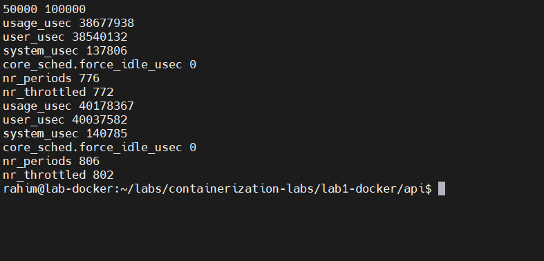

30 периодов за 3 секунды подтверждают период в 100 мс. Задросселированы все 30 из 30: `/burn` хочет целое ядро, получает половину, значит упирается в квоту каждый период без исключения. Прирост `usage_usec` — ровно 1,5 секунды процессорного времени на 3 секунды реального, те самые 0.5 ядра.

**Ключевое отличие от памяти.** Процесс не убит и вообще не знает об ограничении — он просто реже получает процессор. Память несжимаема: выдать 100 МиБ тому, кто просит 200, нельзя, можно только убить. Процессорное время сжимаемо: можно выдать меньше и растянуть во времени. Отсюда практика ставить `requests` на CPU всем, а `limits` — осторожно: троттлинг режет выполнение кусками по 100 мс и портит хвосты латентности даже при невысокой средней загрузке.

### pids.max против форк-бомбы

```bash
echo 20 | sudo tee /sys/fs/cgroup/lab-pids/pids.max
sudo bash -c 'echo $$ > /sys/fs/cgroup/lab-pids/cgroup.procs; exec stress-ng --fork 50 --timeout 10s'
```

`exec` здесь принципиален: он заменяет шелл на `stress-ng`, сохраняя PID и принадлежность к cgroup.

```
pids.current: 20 из 20
pids.events:  max 232476
```

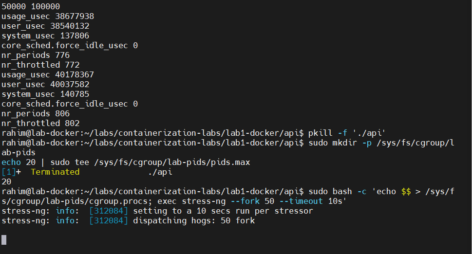
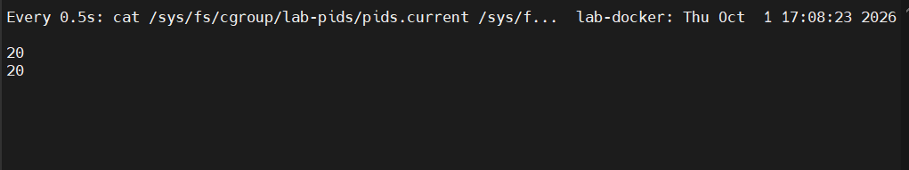

232 476 отклонённых `fork` за десять секунд. Ядро возвращало `EAGAIN` на каждый, группа так и не выросла выше 20 задач, а система осталась полностью отзывчивой — вторая SSH-сессия работала без заминок.

Это единственный из трёх лимитов, который защищает **хост от контейнера**, а не нарезает ресурсы. `memory.max` и `cpu.max` делят то, что есть; `pids.max` закрывает классическую атаку на исчерпание таблицы процессов.

## Часть 4 — Права

Два механизма, отвечающие на разные вопросы: capabilities — «вправе ли процесс выполнять привилегированные операции», seccomp — «какие системные вызовы ему вообще доступны».

### Capabilities

Всемогущество root разобрано примерно на 40 отдельных возможностей. Docker по умолчанию оставляет контейнеру 14 из них, остальные отбирает.

```bash
sudo date -s "$(date -R)"                                  # проходит: у root есть CAP_SYS_TIME
sudo capsh --drop=cap_sys_time -- -c 'date -s "$(date -R)"'  # date: cannot set date: Operation not permitted
```

Установка времени в его же текущее значение — привилегированная операция, которая при этом не сбивает часы, поэтому её удобно использовать как пробу.

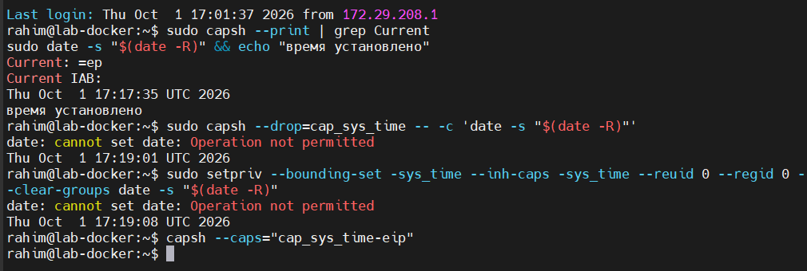

Процесс после сброса по-прежнему uid 0 и по-прежнему «root», но конкретно эту операцию ядро ему больше не разрешает. Эквивалентный способ, более удобный для скрипта:

```bash
sudo setpriv --bounding-set -sys_time --inh-caps -sys_time --reuid 0 --regid 0 --clear-groups date -s "$(date -R)"
```

**Ловушка.** Вариант `capsh --caps="cap_sys_time-eip"` выполняется без ошибок и выглядит убедительно, но **ничего не блокирует** — команда спокойно отрабатывает. Разница в наборах: bounding set ограничивает, что процесс может приобрести, effective set — что он может прямо сейчас. Легко отобрать не тот набор и считать, что защита стоит.

### Seccomp

Профиль в формате Docker, точечные запреты поверх разрешающего действия по умолчанию: [`seccomp/api-seccomp.json`](seccomp/api-seccomp.json).

Запрещены `chmod`/`fchmod`/`fchmodat`, `mount`/`umount2`, `ptrace`, `keyctl`/`add_key`/`request_key`, `reboot`, `kexec_load`. HTTP-сервису на Go ни один из них в нормальной работе не нужен, а `mount`, `ptrace` и `keyctl` фигурируют в большинстве CVE про побег из контейнера.

```bash
docker run --rm alpine:3.20 sh -c 'touch /tmp/f && chmod 777 /tmp/f'                    # проходит
docker run --rm --security-opt seccomp=$PWD/seccomp/api-seccomp.json alpine:3.20 \
    sh -c 'touch /tmp/f && chmod 777 /tmp/f'                                            # Operation not permitted
```

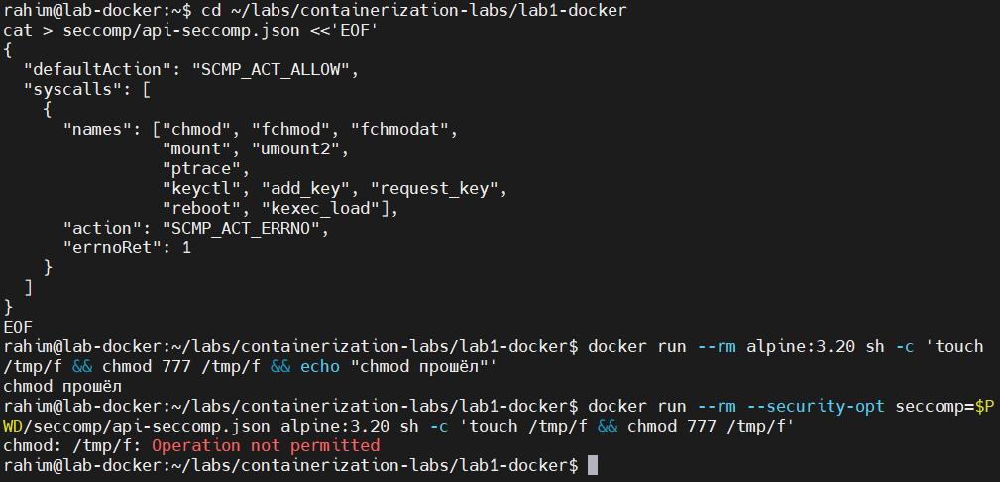

В продакшене профиль обычно строят наоборот — запрет по умолчанию и белый список разрешённых вызовов. Такой профиль надёжнее, но занимает сотни строк; для лабы выбран читаемый вариант.

### Что закрывает каждый механизм

`chmod` на собственный файл в `/tmp` — операция **непривилегированная**, никаких capabilities для неё не требуется. Поэтому сбросом capabilities её не остановить в принципе: нечего сбрасывать. Seccomp же режет вызов на входе в ядро, независимо от прав.

| Механизм | Что ограничивает | Чего не может |
|---|---|---|
| capabilities | привилегированные операции (смена времени, работа с сетью, монтирование) | непривилегированные вызовы — они вне его компетенции |
| seccomp | поверхность системных вызовов целиком | различать контекст: вызов запрещён всем и всегда |

Механизмы дополняют друг друга и не заменяют: capabilities сужают то, что процессу *позволено*, seccomp — то, что он *физически способен попросить* у ядра.

### Ограничение для Части 5

Seccomp применён **через Docker**, а не собственным скриптом. Наложить его из голого shell нечем: это не флаг `unshare`, а системный вызов, который процесс делает сам о себе, до `exec`. Варианты — вспомогательный код с libseccomp или `systemd-run` с `SystemCallFilter`. Это честная строка в сравнение «что Docker делает сверх моего скрипта».

## Часть 5 — mydocker.sh против docker run

Скрипт [`mydocker.sh`](mydocker.sh) одной командой запускает `api` в пяти namespace, с тремя cgroup-лимитами и полностью сброшенными правами.

### Порядок операций и почему он такой

```
cgroup → лимиты → членство ($$ в cgroup.procs) → namespaces → настройка внутри → сброс прав → exec api
```

Три решения определили структуру:

**Cgroup настраивается до запуска.** Иначе процесс успеет выделить память раньше, чем появится лимит.

**Членство записывается до `unshare`, а не после.** Cgroups и namespaces ортогональны: смена namespace не меняет cgroup, поэтому членство наследуется потомками автоматически. Ловить хостовый PID запущенного процесса не нужно — достаточно поместить в cgroup сам скрипт. Так же поступает `runc`.

**Права сбрасываются последними.** `hostname` и `ip link set lo up` внутри namespace требуют `CAP_SYS_ADMIN` и `CAP_NET_ADMIN`; сервису на порту 8080 не нужно ничего. Поэтому сначала настройка, затем `setpriv` с обнулением всех наборов, и только потом `exec ./api`.

Два `exec` в цепочке — чтобы процесс заменялся, а не порождался: в итоге `api` получает PID 1 внутри namespace, без промежуточных шеллов в дереве.

### Результат

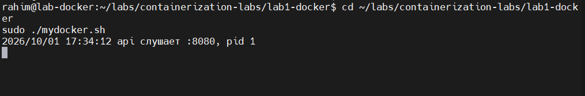
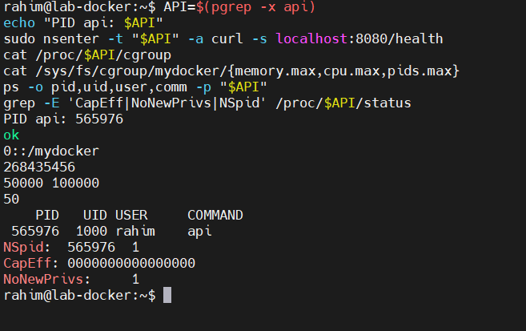

| Проверка | Значение |
|---|---|
| `/health` изнутри | `ok` |
| cgroup | `0::/mydocker` |
| `memory.max` / `cpu.max` / `pids.max` | 256 МиБ / `50000 100000` / 50 |
| uid процесса | 1000, при запуске скрипта от root |
| `CapEff`, `CapBnd` | `0000000000000000` |
| `NoNewPrivs` | 1 |
| `NSpid` | `565976 1` |

---

## Сравнение с `docker run`

Эквивалент для сравнения: `docker run -d --rm -m 256m --cpus 0.5 --pids-limit 50 alpine:3.20 sleep 300`.

### Namespaces: сравнение inode

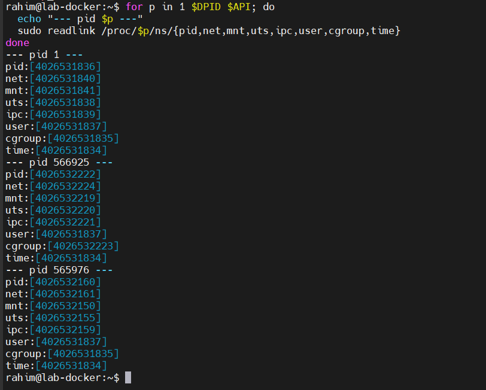

| namespace | Хост | Docker | `mydocker.sh` |
|---|---|---|---|
| pid, net, mnt, uts, ipc | — | свои | свои |
| **user** | ...1837 | ...1837 — **общий с хостом** | ...1837 — **общий с хостом** |
| **cgroup** | ...1835 | ...2223 — **свой** | ...1835 — общий с хостом |
| time | ...1834 | общий | общий |

### Права

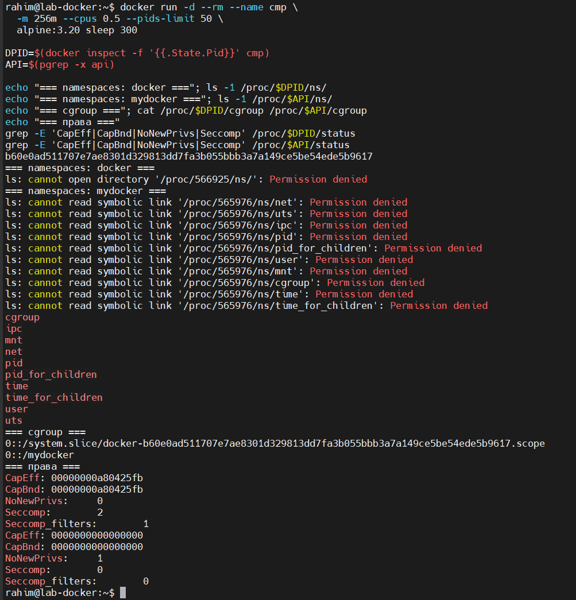

| | Docker | `mydocker.sh` |
|---|---|---|
| `CapEff` | `a80425fb` — 14 capabilities | `0` — ни одной |
| `NoNewPrivs` | 0 | 1 |
| `Seccomp` | 2 — фильтр установлен | 0 — фильтра нет |
| cgroup | `/system.slice/docker-<id>.scope` | `/mydocker` |

Маска Docker расшифровывается так:

```
cap_chown, cap_dac_override, cap_fowner, cap_fsetid, cap_kill, cap_setgid,
cap_setuid, cap_setpcap, cap_net_bind_service, cap_net_raw, cap_sys_chroot,
cap_mknod, cap_audit_write, cap_setfcap
```

### Что совпадает

Пять namespace (pid, net, mnt, uts, ipc), три лимита через cgroup v2, запуск главного процесса как PID 1 своего namespace. По механике изоляции скрипт воспроизводит Docker один в один — потому что Docker и не делает ничего другого, он использует те же вызовы ядра.

**User namespace не использует ни тот, ни другой.** У Docker это умолчание: `--userns-remap` ломает совпадение uid между хостом и контейнером, а значит права на bind-mount томах, слои образов и доступ к сокетам. Вдобавок ремап в Docker один на весь демон, поэтому изоляции контейнеров друг от друга он всё равно не даёт. Практическое следствие: root в контейнере по умолчанию — настоящий root хоста с урезанными capabilities, и `--privileged` опасен именно потому, что возвращает их обратно.

### Где скрипт строже Docker

- **Capabilities:** ноль против четырнадцати. Сервису на непривилегированном порту не нужна ни одна.
- **`NoNewPrivs=1`:** процесс не может приобрести права обратно через setuid-бинарники. У Docker по умолчанию 0.

### Чего в скрипте нет

| Чего нет | Почему и чем это грозит |
|---|---|
| **Корневая файловая система** | процесс видит `/` хоста целиком; mount namespace изолирует список монтирований, но не подменяет корень. Это задача образа — Часть 6 |
| **Проброс портов** | сервис внутри netns недостижим снаружи. Нужна veth-пара, бридж и правила NAT — половина сетевого стека Docker |
| **Seccomp** | накладывается системным вызовом, который процесс делает сам о себе до `exec`; из голого shell сделать нечем. Нужен вспомогательный код с libseccomp или `systemd-run` с `SystemCallFilter` |
| **cgroup namespace** | контейнер видит полный путь `0::/mydocker` вместо `0::/` и тем самым узнаёт топологию хоста. Чинится флагом `-C` у `unshare` |
| **Интеграция с systemd** | Docker размещает контейнеры в `system.slice`, поэтому systemd корректно останавливает их при выключении и может ограничивать весь срез разом |

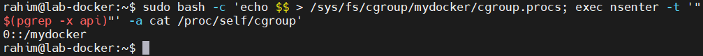

### Что Docker делает сверх изоляции

Всё перечисленное выше плюс то, к механизмам ядра отношения не имеющее: получение и распаковка образов, слои и кэш сборки, управление жизненным циклом (перезапуски, healthcheck), сбор логов, именование и обнаружение контейнеров, настройка `/dev`, профиль AppArmor, ограничение устройств через `devices`-контроллер.

### Побочное наблюдение: `nsenter` обходит cgroup

Попытка посмотреть на cgroup глазами контейнера через `sudo nsenter -t <pid> -a cat /proc/self/cgroup` показала cgroup **SSH-сессии**, а не контейнера. `nsenter` переводит процесс между namespace, но членство в cgroup не меняет — ещё одно подтверждение их ортогональности.

Для отладки это важно: процесс, запущенный через голый `nsenter`, окажется **вне лимитов** контейнера. `docker exec` так не промахивается — он помещает новый процесс и в namespace, и в cgroup.

## Часть 6 — Образы

Образ — это та самая недостающая корневая файловая система, на которую упёрлась Часть 5: mount namespace изолирует список монтирований, но подменять корень ему нечем.

Собраны два варианта одного сервиса: наивный [`Dockerfile.simple`](Dockerfile.simple) и multi-stage [`Dockerfile`](Dockerfile).

### Сравнение размеров

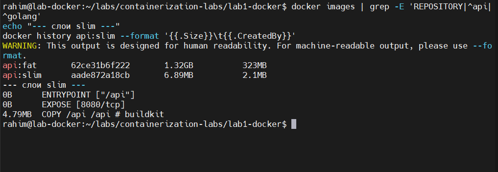

| Образ | Размер | Слоёв с данными |
|---|---|---|
| `api:fat` | **1.32 ГБ** | весь тулчейн Go внутри |
| `api:slim` | **6.89 МБ** | один слой, 4.79 МБ |

Разница почти в **200 раз** при одном и том же сервисе. В `slim` три слоя, из них два — чистые метаданные по 0 Б: `ENTRYPOINT` и `EXPOSE` пишутся в манифест образа и ничего не кладут в файловую систему.

Бинарник похудел с 6.7 МБ до 4.79 МБ за счёт `-ldflags="-s -w"` — выброшены таблица символов и отладочная информация.

`FROM scratch` работает только потому, что бинарник собран с `CGO_ENABLED=0` и статически слинкован. Был бы хоть один вызов в libc через cgo — образ не запустился бы, причём без внятной ошибки: в `scratch` нет ни динамического загрузчика, ни шелла, чтобы об этом сообщить.

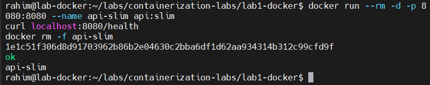

Главный аргумент за `scratch` не размер, а **поверхность атаки**. В `fat` лежит компилятор Go, исходники стандартной библиотеки и полноценный Debian с `apt`, `curl` и `bash` — попавший внутрь злоумышленник получает рабочую среду. В `scratch` выполнять нечего, кроме самого сервиса.

### Кэш сборки

Первый эксперимент дал неожиданный результат: после `touch api/main.go` пересборка показала **сплошные `CACHED`**.

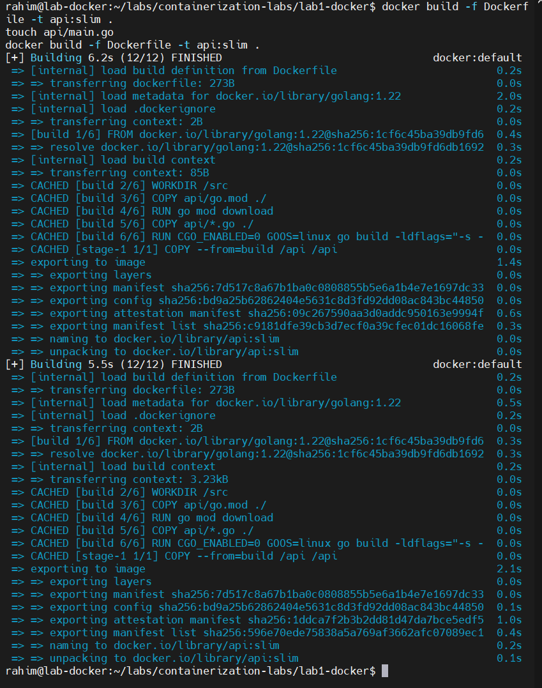

Причина в механике BuildKit: он считает **контрольную сумму содержимого**, а не время модификации. Старый классический билдер сравнивал файлы по mtime и размеру, и `touch` его обманывал. BuildKit перечитал контекст (`transferring context` вырос с 85 B до 3.23 kB), но хеш совпал, и ни один слой не пересобрался.

Реальное изменение содержимого ломает кэш там, где и задумано:

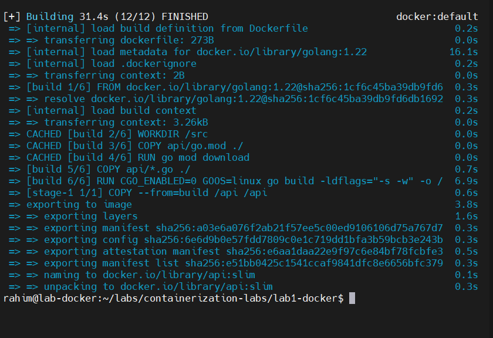

```
CACHED [build 2/6] WORKDIR /src
CACHED [build 3/6] COPY api/go.mod ./
CACHED [build 4/6] RUN go mod download     <- зависимости не перекачивались
       [build 5/6] COPY api/*.go ./        <- отсюда пересборка
       [build 6/6] RUN go build ...
```

Ради этого `go.mod` и копируется отдельной инструкцией до исходников: слой с зависимостями живёт своей жизнью, и правка кода его не трогает. Скопируй всё одним `COPY` — и каждая правка `main.go` будет заново тянуть модули.

### Эфемерность слоя записи

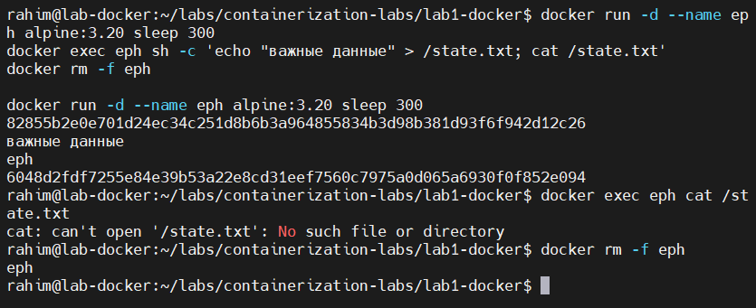

Файл, записанный в контейнер, не пережил `docker rm -f` и пересоздание: `cat: can't open '/state.txt': No such file or directory`.

С именованным томом те же данные остались на месте:

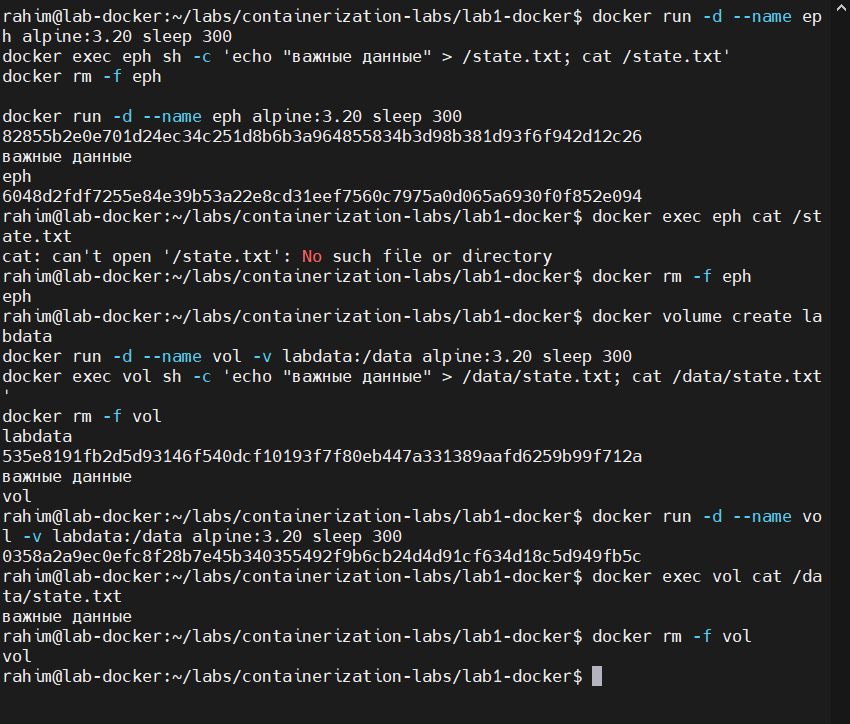

### Где это лежит физически

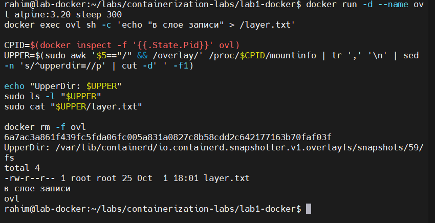

```
UpperDir: /var/lib/containerd/io.containerd.snapshotter.v1.overlayfs/snapshots/59/fs
          └── layer.txt   "в слое записи"
Том:      /var/lib/docker/volumes/labdata/_data
```

Корень контейнера собран overlayfs из трёх частей: `lowerdir` — слои образа, смонтированные только для чтения; `upperdir` — единственный записываемый слой поверх них; `workdir` — служебная область для атомарных операций. Запись в существующий файл вызывает copy-up: файл сначала копируется из нижнего слоя в верхний, и правится уже копия.

Отсюда и эфемерность: `docker rm` удаляет `upperdir`, слои образа остаются нетронутыми и переиспользуются другими контейнерами. Том лежит отдельно, вне overlayfs и вне жизненного цикла контейнера.

**Деталь версии.** Docker 29 использует containerd snapshotter (`driver-type: io.containerd.snapshotter.v1`), поэтому слои переехали из `/var/lib/docker/overlay2/` в `/var/lib/containerd/...`, а поле `GraphDriver.Data` в `docker inspect` опустело. Инструкции и скрипты, полагающиеся на `docker inspect -f '{{.GraphDriver.Data.UpperDir}}'`, ломаются. Надёжнее брать данные из первоисточника — таблицы монтирований процесса контейнера:

```bash
CPID=$(docker inspect -f '{{.State.Pid}}' <container>)
sudo awk '$5=="/" && /overlay/' /proc/$CPID/mountinfo | tr ',' '\n' | sed -n 's/^upperdir=//p'
```

## Часть 7 — Когда контейнера мало

<!-- чем gVisor устроен иначе; что остаётся общим с хостом всегда -->

## Часть 8 — Мониторинг

<!-- дашборд; три метрики под алерты с обоснованием -->
