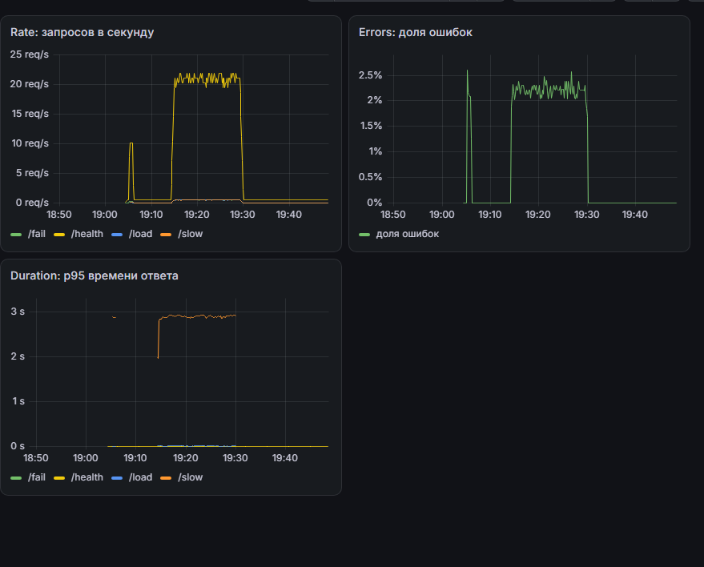
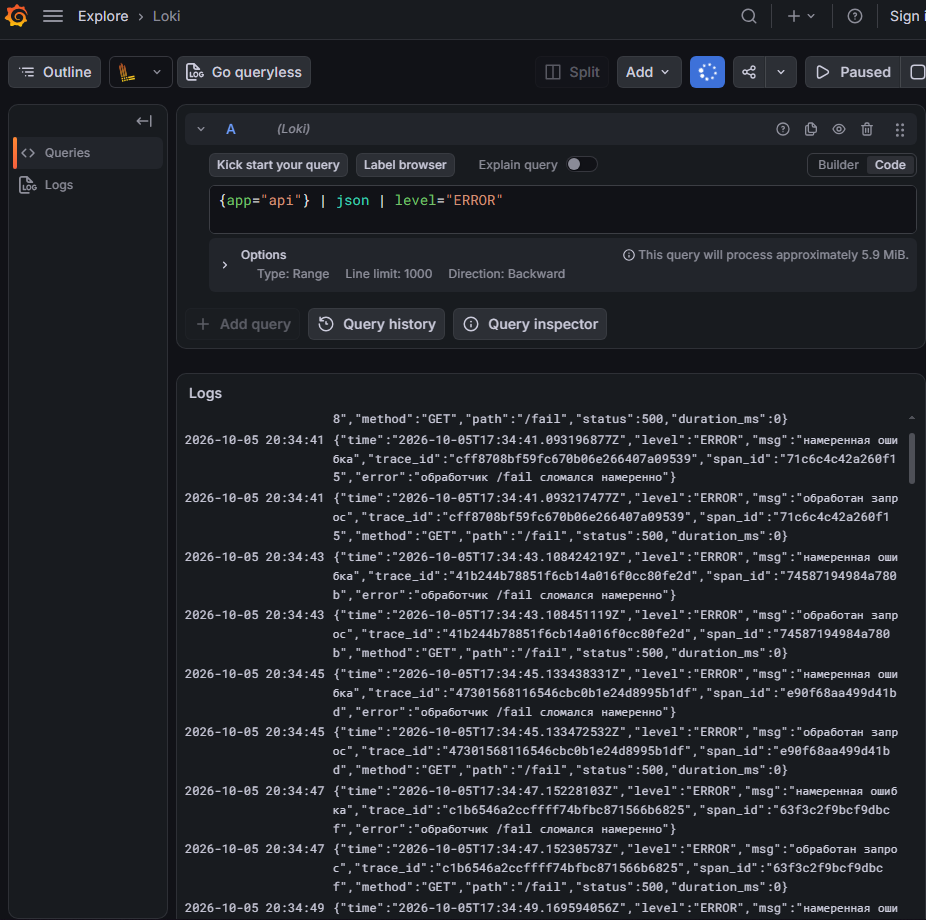
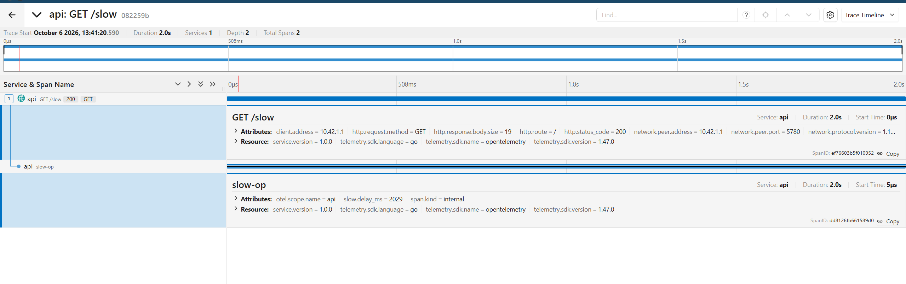
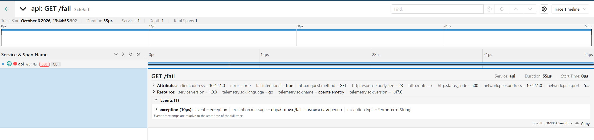
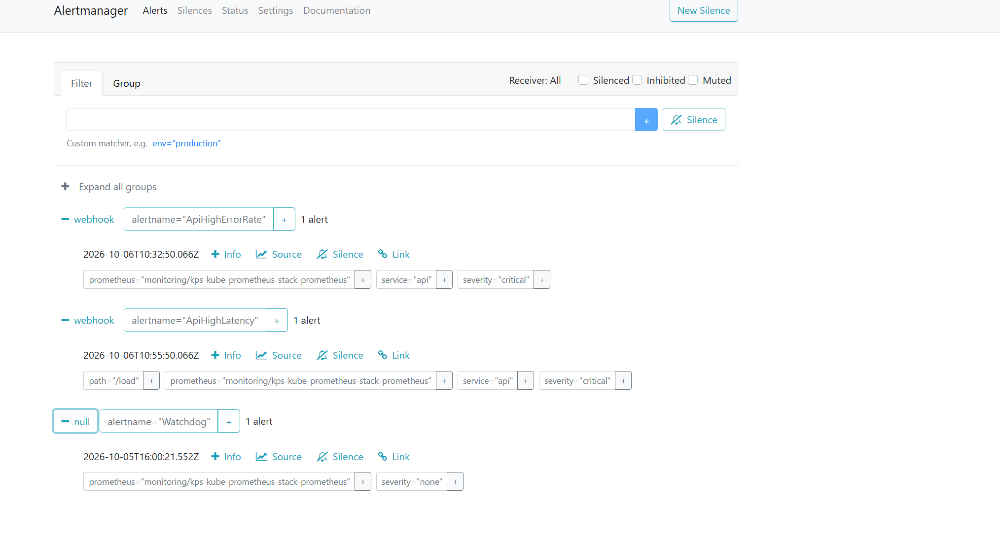
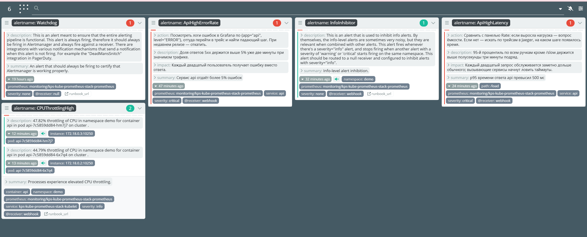

# Лабораторная работа 2. Мониторинг сервиса: метрики, логи, трейсы

Задача: поднять полный мониторинг одного сервиса и связать три сигнала между собой. Метрики в Prometheus, логи в Loki, трейсы в Jaeger, всё видно в Grafana, алерты уходят в Alertmanager и показываются в Karma.

Главное отличие от первой лабы: **работаем только в Kubernetes и ставим всё через Helm**. Docker compose запрещён явно, так что стек из первой лабы сюда не переехал, собирал заново.

Среда: Ubuntu 24.04 в Hyper-V, кластер k3d (k3s 1.35) на двух нодах, Helm 4.3, kubectl 1.37.

---

## Шаг 0. Подопытный сервис

Сервис на Go, четыре ручки для провокации ситуаций плюс метрики.

| Эндпоинт | Что делает |
|---|---|
| `GET /health` | отдаёт `ok` |
| `GET /fail` | отвечает 500 и помечает спан ошибочным |
| `GET /slow` | спит 1..3 секунды внутри вложенного спана `slow-op` |
| `GET /load?n=N` | делает N запросов к самому себе, поднимает RPS |
| `GET /metrics` | метрики Prometheus |

Три вещи, которые сервис обязан уметь по заданию, и как они сделаны.

**Метрики RED.** Счётчик запросов, счётчик ошибок и гистограмма времени ответа:

```go
http_requests_total{method, path, status}
http_request_errors_total{method, path}
http_request_duration_seconds{method, path}
```

Метка `path` берётся из имени маршрута, а не из `r.URL.Path`. Иначе каждый новый набор query-параметров породил бы новый временной ряд, и кардинальность метрик росла бы бесконечно.

**Логи с trace_id.** Структурированный JSON через `log/slog`, и в каждую строку подставляется идентификатор текущего трейса:

```go
func logger(ctx context.Context) *slog.Logger {
    l := slog.Default()
    sc := trace.SpanContextFromContext(ctx)
    if sc.IsValid() {
        l = l.With("trace_id", sc.TraceID().String(), "span_id", sc.SpanID().String())
    }
    return l
}
```

**Трейсинг через OpenTelemetry.** Библиотека `otelhttp` сама создаёт корневой спан на каждый входящий запрос, а вложенные я создаю руками там, где это осмысленно: `slow-op` внутри `/slow` и `load-generator` внутри `/load`.

### 1. На чём споткнулся при сборке

Первая сборка упала: `undefined: otelhttp.WithRouteTag`. Функция, которой я называл спаны по маршрутам, из свежей версии библиотеки пропала. Заменил на форматтер имён, и получилось даже лучше, имена вида `GET /slow` читаются понятнее:

```go
otelhttp.NewHandler(mux, "http.server",
    otelhttp.WithSpanNameFormatter(func(_ string, r *http.Request) string {
        return r.Method + " " + r.URL.Path
    }),
)
```

Вторая проблема была интереснее. Сервис запускался, но `trace_id` в логах не появлялся, а в первой строке висело предупреждение:

```
трейсинг не поднялся, работаю без него
error: conflicting Schema URL: https://opentelemetry.io/schemas/1.43.0
       and https://opentelemetry.io/schemas/1.26.0
```

<details><summary><b>Примечание: почему конфликтуют версии схемы</b></summary>

Ресурс в OpenTelemetry это набор атрибутов, описывающих источник телеметрии: имя сервиса, версия, хост. У набора есть Schema URL, то есть версия семантических соглашений, по которым атрибуты названы.

Я собирал ресурс через `resource.Merge(resource.Default(), ...)`, а свой кусок создавал с явной схемой `semconv/v1.26.0`. При этом `resource.Default()` в свежем SDK использует схему 1.43.0. Слить ресурсы с разными Schema URL функция отказывается, и возвращает ошибку.

Решение: собирать свою часть без схемы вообще.

```go
res, err := resource.Merge(resource.Default(), resource.NewSchemaless(
    semconv.ServiceName(serviceName),
    semconv.ServiceVersion("1.0.0"),
))
```

`NewSchemaless` не навязывает версию и сливается с любой.
</details>

После правки `trace_id` появился, и ровно он потом связал логи с трейсами.

Образ собрал multi-stage на `scratch`, получилось 23 МБ. Код сервиса в [api/](api/).

---

## Шаг 1. Кластер

### 1. Подготовка

Поставил `kubectl`, `helm` и `k3d`. Выбрал k3d, а не minikube или kind: он легче всех по памяти, а виртуалке я выделил 8 ГБ, и половину из них должен был занять стек наблюдаемости.

Память, кстати, пришлось переводить из динамической в статическую.

<details><summary><b>Примечание: почему динамическая память и Kubernetes плохо сочетаются</b></summary>

Hyper-V умеет отдавать виртуалке память по мере надобности, раздувая и сдувая баллон. Для обычной рабочей машины это удобно, для Kubernetes вредно.

Компоненты кластера считывают объём доступной памяти при старте и выставляют по нему внутренние лимиты. Если в этот момент баллон сдут, они настроятся на заниженное значение. Плюс при резком всплеске баллон не всегда успевает раздуться, и получаешь OOM на ровном месте при формально свободной памяти.

Зафиксировал 8 ГБ статикой.
</details>

Кластер создаётся скриптом [cluster/create-cluster.sh](cluster/create-cluster.sh): две ноды, Traefik отключён, порты 30000-30010 проброшены с хоста.

Две ноды, а не одна, намеренно: в части с логами агент сбора разворачивается DaemonSet'ом, то есть по поду на ноду. На одной ноде смысл DaemonSet не виден.

Traefik отключил, потому что иначе пришлось бы настраивать маршрутизацию по путям для шести веб-интерфейсов, а это требует правки базового URL в каждом приложении: у Grafana `serve_from_sub_path`, у Jaeger `query.base-path`, у Alertmanager `--web.external-url`. Возни много, пользы для задания никакой. Вместо этого отдал диапазон NodePort, и каждый интерфейс получил свой адрес.

| Порт | Что |
|---|---|
| 30000 | Grafana |
| 30001 | Prometheus |
| 30002 | Alertmanager |
| 30003 | сервис api |
| 30004 | Jaeger |
| 30005 | Karma |

---

## Шаг 2. Метрики: Prometheus и Grafana

### 1. Сервис в кластере

Образ собран локально, поэтому его надо занести в ноды:

```bash
k3d image import api:v1 -c obs
```

И обязательно `imagePullPolicy: IfNotPresent` в чарте. С политикой `Always` под не поднялся бы: kubelet пошёл бы искать `api:v1` в Docker Hub, где такого образа нет.

Сервис оформлен своим Helm-чартом [helm/api/](helm/api/), а не голыми манифестами: задание требует разворачивать всё через Helm, и держать приложение особняком было бы непоследовательно.

### 2. Стек мониторинга

Поставил `kube-prometheus-stack`: он даёт Prometheus, Grafana, Alertmanager и оператор одним релизом, плюс CRD `ServiceMonitor`, которые понадобятся для сбора метрик сервиса. Values в [helm/values/kube-prometheus-stack.yaml](helm/values/kube-prometheus-stack.yaml).

Два решения в конфигурации, без которых ничего не заработало бы.

**`serviceMonitorSelectorNilUsesHelmValues: false`.** По умолчанию оператор подбирает только те `ServiceMonitor`, у которых метка релиза совпадает с его собственной. Чарт `api` ставится отдельным релизом, так что без этого флага его метрики просто не попали бы в сбор. Насколько понимаю, это самая частая причина жалоб «Prometheus не видит мой сервис».

**Отключены `kubeEtcd`, `kubeControllerManager`, `kubeScheduler`, `kubeProxy`.** В k3s эти компоненты живут внутри одного процесса и отдельными сервисами наружу не выставлены. Оставь их включёнными, получишь четыре вечно красные цели и ложное ощущение, что в кластере что-то сломано.

После включения `ServiceMonitor` Prometheus подхватил оба пода:

```
api  up  http://10.42.0.3:8080/metrics
api  up  http://10.42.1.4:8080/metrics
```

### 3. Дашборд RED



```promql
# Rate
sum by (path) (rate(http_requests_total{job="api"}[1m]))

# Errors
sum(rate(http_request_errors_total{job="api"}[1m]))
  / sum(rate(http_requests_total{job="api"}[1m]))

# Duration
histogram_quantile(0.95,
  sum by (le, path) (rate(http_request_duration_seconds_bucket{job="api"}[1m])))
```

Разбивка по `path` тут не украшение. Сначала я померил сводный p95 по всем ручкам и получил 4.7 мс, хотя `/slow` в это же время отвечала за 2.9 секунды:

| Ручка | Запросов/с | p95 |
|---|---|---|
| `/health` | 21.06 | 0.005 с |
| `/slow` | 0.50 | **2.875 с** |
| `/load` | 0.50 | 0.009 с |
| `/fail` | 0.48 | 0.005 с |

Быстрых запросов в сорок раз больше, и медленная ручка просто не доживает до 95-го процентиля общей выборки. Агрегированный процентиль по разнородным эндпоинтам систематически прячет проблему.

<details><summary><b>Примечание: зачем le в группировке</b></summary>

В запросе p95 группировка обязательно включает `le`:

```promql
histogram_quantile(0.95, sum by (le, path) (rate(..._bucket[1m])))
```

`le` это метка границы корзины гистограммы (less or equal). Гистограмма Prometheus состоит из счётчиков «сколько наблюдений уложилось в границу X», и `histogram_quantile` восстанавливает квантиль именно по ним. Уберёшь `le` из группировки, функция получит бессмысленный набор и вернёт `NaN`.
</details>

---

## Шаг 3. Логи: Loki и агент сбора

Задание отдельно проговаривает мысль, которую легко упустить: **Loki сам логи ниоткуда не забирает**. Это хранилище с индексом по меткам. Собирает вывод подов отдельный агент, который ставится на каждую ноду.

Взял Grafana Alloy: это преемник Promtail, который Grafana объявила устаревшим.

### 1. Loki

Ставил в однобинарном режиме, values в [helm/values/loki.yaml](helm/values/loki.yaml). Распределённая схема с отдельными ingester, querier и compactor для учебного кластера избыточна, все эти компоненты выставлены в ноль реплик.

Одна настройка заслуживает пояснения:

```yaml
limits_config:
  reject_old_samples: false
```

Loki по умолчанию отбрасывает строки, чья метка времени слишком старая. При сборе из кластера агент нередко отправляет накопившееся пачкой, и часть строк формально оказывается из прошлого. Без этого послабления они молча теряются, а потом сидишь и гадаешь, почему логи неполные.

### 2. Агент сбора

Alloy развернулся DaemonSet'ом, по поду на каждую ноду:

```
alloy-78zzd  2/2  Running  k3d-obs-server-0
alloy-tj9jd  2/2  Running  k3d-obs-agent-0
```

Рядом в кластере с той же схемой живёт `prometheus-node-exporter`, и это не совпадение: оба компонента собирают то, что физически привязано к конкретной машине.

Конфигурация в [helm/values/alloy.yaml](helm/values/alloy.yaml). Три решения в ней стоит объяснить.

**Чтение через API Kubernetes, а не из файлов.** Компонент `loki.source.kubernetes` берёт логи так же, как это делает `kubectl logs`. Альтернатива, чтение файлов из `/var/log/pods`, требует монтировать hostPath и знать расположение логов конкретного рантайма.

**`level` становится меткой, а `trace_id` нет.** Это самое важное место конфигурации:

```river
stage.labels {
  values = { level = "" }
}
stage.structured_metadata {
  values = { trace_id = "" }
}
```

<details><summary><b>Примечание: почему trace_id нельзя делать меткой</b></summary>

Loki индексирует метки, а не содержимое строк. Каждая уникальная комбинация меток порождает отдельный поток со своим индексом и своими файлами чанков.

У `level` значений пять штук, он отлично годится в метки: фильтр `{app="api", level="ERROR"}` отработает по индексу и будет дешёвым.

У `trace_id` значение уникально для каждого запроса. Сделай его меткой, и при тысяче запросов в секунду получишь тысячу новых потоков в секунду. Индекс распухнет, Loki ляжет. Это классическая ошибка, которую называют взрывом кардинальности.

Структурированные метаданные решают ровно эту задачу: значение хранится рядом со строкой, по нему можно искать, но в индекс меток оно не попадает.
</details>

**Переименование служебных меток.** Без блока `discovery.relabel` в Loki приехали бы метки вида `__meta_kubernetes_pod_name`, читать которые невозможно.

### 3. Результат



```logql
{app="api"} | json | level="ERROR"
```

Метки разобраны правильно: `app=api`, `container=api`, `level=ERROR`, `namespace=demo`, `pod=api-89b7fd876-b4g7n`. В каждой строке `trace_id` и `span_id`.

Над результатами Grafana показывает подсказку `This query will process approximately 5.9 MiB`. Loki честно сообщает объём, который придётся прочитать: всё после вертикальной черты применяется уже не к индексу, а к содержимому строк. Поэтому сначала максимально сужают селектор в фигурных скобках, и только потом фильтруют.

---

## Шаг 4. Трейсы: OpenTelemetry и Jaeger

### 1. Jaeger второй версии оказался другим

Поставил `jaegertracing/jaeger` в варианте all-in-one и написал в values привычные переменные окружения:

```yaml
extraEnv:
  - name: COLLECTOR_OTLP_ENABLED
    value: "true"
  - name: SPAN_STORAGE_TYPE
    value: memory
```

Образ оказался версии 2.21.0, и обе переменные он просто проигнорировал. Во второй версии Jaeger настраивается конфигурационным файлом, а приёмники OTLP и хранилище в памяти включены по умолчанию. Блок `extraEnv` я из values убрал как бесполезный.

API тоже переехал. Запрос `/api/services` отдавал 404, пока я не выяснил, что правильный путь теперь `/api/v3/services`. В интерфейсе поиска соответственно поле `Operation` переименовано в `Span Name`.

### 2. Чарт не умеет публиковать UI

Задать сервису тип NodePort через values не вышло. В блоке `allInOne.service` чарта есть `labels`, `annotations` и `extraPorts`, а `type` отсутствует, то есть тип жёстко `ClusterIP`.

Сделал отдельный мини-чарт [helm/jaeger-nodeport/](helm/jaeger-nodeport/) с одним сервисом, селектор которого смотрит на под Jaeger. Решение в духе задания: всё остаётся в Helm, ничего не делается руками через `kubectl patch`.

### 3. Трейсы

После того как сервис получил `OTEL_EXPORTER_OTLP_ENDPOINT`, Jaeger увидел все операции:

```
GET /slow        server      <- корневой спан запроса
  slow-op        internal    <- вложенный, здесь уходит время
GET /fail        server
GET /load        server
  load-generator internal
  HTTP GET       client      <- исходящие запросы к себе
```



```
Duration 2.0s | Depth 2 | Total Spans 2
  GET /slow   2.0s   http.status_code = 200
    slow-op   2.0s   slow.delay_ms = 2029, span.kind = internal
```

Вложенный спан занимает почти всю длительность запроса. Это и есть ответ на вопрос, на который метрики ответить не могут: время ушло не на приём запроса и не на формирование ответа, а внутрь конкретной операции. Атрибут `slow.delay_ms` подтверждает числом.



```
Duration 55µs | Depth 1 | Total Spans 1
  GET /fail   error = true, fail.intentional = true, http.status_code = 500
  Events (1): exception.message = обработчик /fail сломался намеренно
              exception.type = *errors.errorString
```

Контраст с предыдущим кадром выразительный: `/slow` это две секунды и вложенный спан, `/fail` это пятьдесят пять микросекунд и статус ошибки. Красным Jaeger помечает не длительность, а статус. Плюс событие `exception` с текстом и типом ошибки, чего в метриках нет в принципе.

### 4. Переход от лога к трейсу

Задание требует, чтобы по `trace_id` из строки лога открывался тот же трейс. Сделал это производным полем источника данных Loki:

```yaml
derivedFields:
  - name: TraceID
    matcherType: regex
    matcherRegex: '"trace_id":"(\w+)"'
    datasourceUid: jaeger
    url: '${__value.raw}'
    urlDisplayLabel: Открыть трейс
```

Теперь Grafana вытаскивает идентификатор прямо из строки лога регулярным выражением и превращает его в кнопку. Копировать ничего не нужно: развернул строку лога, нажал «Открыть трейс», оказался в Jaeger.

---

## Шаг 5. Алерты и Karma

### 1. Три алерта

Правила описаны в values стека, через `additionalPrometheusRulesMap`. Выбирал так, чтобы каждый ловил свой класс проблем, а не три штуки про одно и то же.

**ApiHighErrorRate**, доля 5xx выше 5% две минуты подряд:

```promql
(
  sum(rate(http_request_errors_total{job="api"}[2m]))
  / sum(rate(http_requests_total{job="api"}[2m]))
) > 0.05
and
sum(rate(http_requests_total{job="api"}[2m])) > 1
```

Второе условие принципиально. Без него одна ошибка при трёх запросах в минуту даёт 33% и будит дежурного зря. Я это наблюдал своими глазами: три запроса `/fail` на фоне тишины дали всплеск до 8% на дашборде.

**ApiHighLatency**, p95 выше 500 мс три минуты, по каждой ручке отдельно и без `/slow`:

```promql
histogram_quantile(0.95,
  sum by (le, path) (rate(http_request_duration_seconds_bucket{job="api", path!="/slow"}[5m]))
) > 0.5
```

Две оговорки, и обе выстраданы. `/slow` исключена, потому что она медленная по замыслу: оставь её, и алерт будет гореть всегда, то есть перестанет быть алертом. Расчёт по ручкам, а не сводный: сводный вариант я написал первым, и он не сработал ни разу, хотя `/load` отвечала за 0.95 секунды. Сводный p95 при этом держался на 4.8 мс по той же причине, что и на дашборде.

**ApiDown**, ни один под не отдаёт метрики минуту:

```promql
(sum(up{job="api"}) or vector(0)) == 0
```

<details><summary><b>Примечание: зачем здесь or vector(0)</b></summary>

Казалось бы, достаточно `up{job="api"} == 0`. Но когда все поды исчезают, Prometheus перестаёт получать цели, и ряд `up` пропадает совсем. Сравнивать становится не с чем, выражение возвращает пустой результат, и алерт молчит именно тогда, когда он нужнее всего.

`sum(...) or vector(0)` подставляет ноль, если слева пусто. Теперь выражение истинно и при нулевых значениях, и при отсутствии данных.
</details>

### 2. Главное наблюдение по алертам

Когда я уронил сервис полностью, чтобы проверить `ApiDown`, случилось вот что:

```
[30с] HighErrorRate=firing  Down=pending
[90с] HighErrorRate=inactive  Down=firing
```

**Алерт по ошибкам погас.** Запросов нет, доля ошибок не вычисляется, метрика качества исчезла вместе с сервисом.

Это и есть ответ на вопрос, зачем в наборе третий алерт. Метрики вида «доля чего-то плохого» принципиально слепы к полному отказу: они описывают качество обслуживания, а когда обслуживания нет совсем, описывать нечего. Нужен отдельный сигнал про живость.

### 3. Alertmanager и получатель

Задание требует настроить хотя бы одного получателя. Почта и Slack потребовали бы внешних доступов, поэтому поднял webhook-приёмник, который печатает входящие запросы в лог, мини-чарт [helm/alert-webhook/](helm/alert-webhook/). Логи собирает Alloy, так что факт доставки виден в Grafana наравне со всем остальным.

В логе получателя полное тело уведомления:

```json
{"receiver":"webhook","status":"firing","alerts":[{"status":"firing",
 "labels":{"alertname":"ApiHighErrorRate", ...
```

Маршрут настроен так, что служебный `Watchdog` уходит в получателя `"null"`.

<details><summary><b>Примечание: что такое Watchdog и зачем он всегда горит</b></summary>

`kube-prometheus-stack` держит алерт `Watchdog` включённым постоянно. Он не означает проблемы, его задача противоположная: доказывать, что цепочка Prometheus → Alertmanager → получатель работает.

Логика такая: если алерты перестали приходить, это может означать как отсутствие проблем, так и поломку самого мониторинга, и различить эти два случая изнутри невозможно. Поэтому заводят сигнал, который обязан приходить всегда, и внешняя система следит уже за ним: пропал `Watchdog`, значит сломался мониторинг.

Парадокс в том, что для доверия к тишине нужен шум.
</details>



На скриншоте видна маршрутизация: наши алерты сгруппированы под получателем `webhook`, `Watchdog` под `null`. У `ApiHighLatency` в метках `path="/load"`, то есть он сработал именно на той ручке, которая медленная, а не «где-то вообще».

### 4. Как я провоцировал срабатывания

Это заняло неожиданно много попыток, и причина каждый раз была в одном.

Первый заход: гонял `/fail` вместе с `/load?n=200`. Алерт не сработал, доля ошибок составила 0.8% при пороге 5%. Каждый вызов `/load` порождает две сотни успешных запросов к `/health`, и они размывали долю ошибок. Я сам себе испортил эксперимент.

Второй заход: только `/fail`. Доля ошибок дошла до 93%, алерт загорелся, прекрасно. Но алерт по задержке при этом молчал: обработчики `/fail` и `/health` настолько простые, что отвечают за миллисекунды.

Третий заход: пробовал зажать CPU, чтобы вызвать деградацию. Получил ошибку Kubernetes:

```
spec.template.spec.containers[0].resources.requests: Invalid value: "50m":
must be less than or equal to cpu limit of 25m
```

Запросы ресурсов не могут превышать лимиты, про это я забыл.

Итоговый рецепт получился компромиссом, который сам по себе поучителен: `/fail` часто, чтобы доля ошибок держалась выше порога, `/load` редко, но с большим `n`, чтобы набрать статистику по медленной ручке, и лимит CPU в 100m, чтобы эта ручка не укладывалась в полсекунды. Оба алерта загорелись одновременно.

### 5. Karma



Karma не хранит состояние, она опрашивает Alertmanager и раскладывает алерты карточками с группировкой и фильтрами. На двух алертах преимущество перед штатным интерфейсом выглядит косметическим, и честно сказать, на этом стенде оно таким и является. Смысл Karma проявляется, когда алертов сотня и дежурному надо за секунды понять, что именно горит.

Зато на карточках хорошо видно, ради чего задание требует аннотации: читаются `summary`, `description`, `impact` и `action`. Дежурный получает не только «что сломалось», но и «чем это грозит» и «что делать». Эта информация должна приходить вместе с уведомлением, а не лежать в чьей-то голове.

### 6. Неожиданный бонус

В Karma обнаружился алерт, которого я не писал:

```
CPUThrottlingHigh
47.82% throttling of CPU in namespace demo for container api
```

Это штатный алерт `kube-prometheus-stack`, и сработал он потому, что я зажал лимит CPU до 100m ради демонстрации задержки. Кластер сам заметил ровно тот механизм, который я руками разбирал в первой лабе: `cpu.max`, счётчик `nr_throttled`, принудительные простои задач. Связь между двумя лабораторными получилась не на словах, а на живом алерте.

---

## Что в итоге связано

Проверяется это так. Жму `/load`, `/fail`, `/slow`:

- на дашборде RED реагируют все три панели;
- в Grafana по `{app="api"} | json | level="ERROR"` находится строка ошибки;
- в строке лога есть `trace_id`, и кнопка «Открыть трейс» ведёт в Jaeger;
- в Jaeger виден водопад с вложенным медленным спаном и отдельно трейс с красным ошибочным;
- при устойчивом превышении порогов алерты уходят в firing, доезжают до получателя и видны в Alertmanager и Karma.

Восемь релизов Helm в кластере:

| Релиз | Что |
|---|---|
| `api` | подопытный сервис, свой чарт |
| `kps` | Prometheus, Grafana, Alertmanager, оператор |
| `loki` | хранилище логов |
| `alloy` | агент сбора логов, DaemonSet |
| `jaeger` | трейсы, all-in-one |
| `jaeger-ui` | публикация UI Jaeger, свой чарт |
| `alert-webhook` | получатель уведомлений, свой чарт |
| `karma` | дашборд алертов, свой чарт |

---

## Вывод

Главное, что я вынес из этой лабы.

**Версия компонента меняет не только возможности, но и интерфейс.** Jaeger второй версии проигнорировал переменные окружения первой и переехал с `/api/traces` на `/api/v3/traces`, в свежем `otelhttp` исчезла функция, которой я называл спаны, а `resource.Merge` отказался сливать ресурсы с разными версиями семантических соглашений. Каждый раз инструкция из интернета выглядела правильной и не работала.

**Три сигнала отвечают на разные вопросы, и ни один не заменяет остальные.** Метрики говорят «что-то не так и насколько масштабно». Логи говорят «что именно произошло в конкретном запросе». Трейсы говорят «на каком шаге потерялось время». Когда я уронил сервис, метрика доли ошибок перестала существовать вместе с трафиком, и увидеть отказ можно было только отдельным сигналом про живость.

**Агрегат прячет проблему.** Это всплыло дважды в одинаковой форме: сводный p95 по всем ручкам показывал 4.8 мс, пока одна из ручек отвечала секунду, и ровно по той же причине алерт по задержке не срабатывал, пока я не перевёл его на расчёт по каждой ручке отдельно. Процентиль по разнородным выборкам почти всегда врёт в сторону оптимизма.

**Порог это часть алерта, а не настройка.** Доля ошибок без оговорки на минимальный трафик, p95 без исключения заведомо медленной ручки, сравнение с нулём без обработки отсутствия данных, каждый раз формально правильное выражение давало либо ложные срабатывания, либо молчание в нужный момент.
