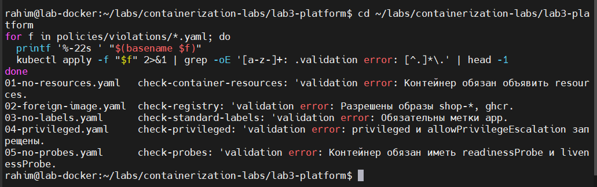
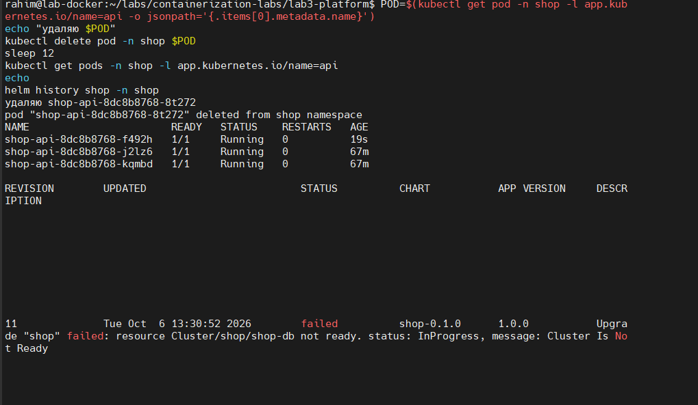
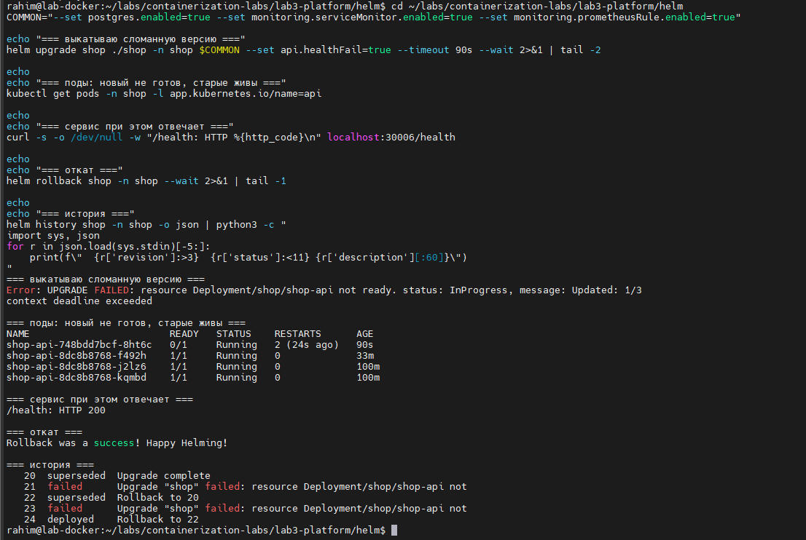
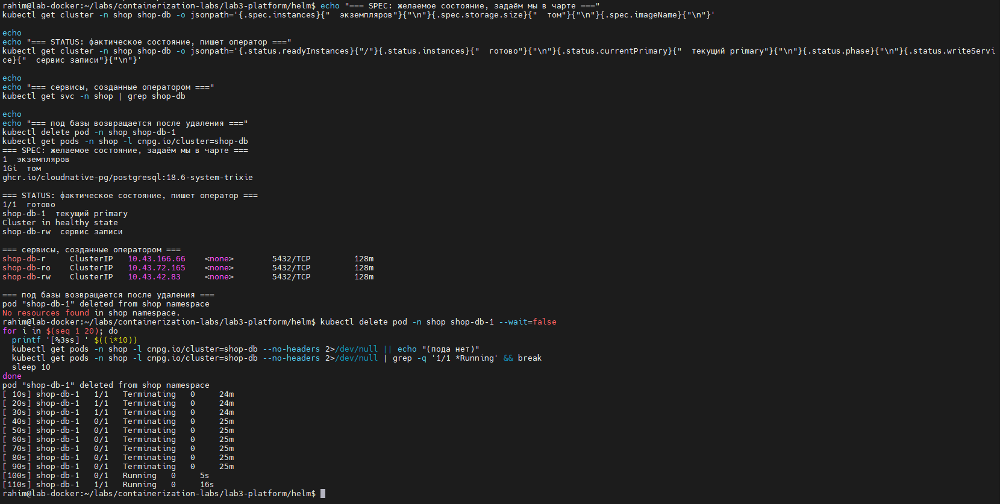
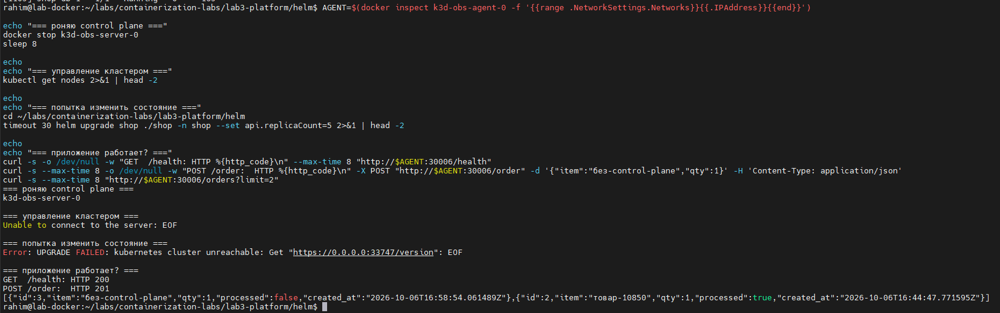
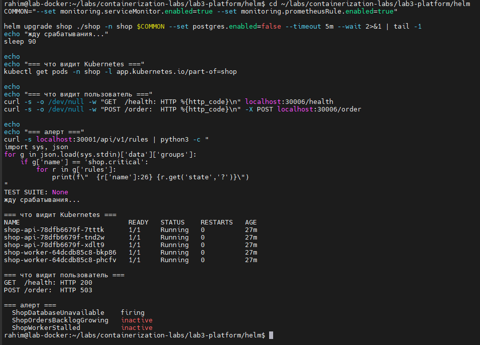

# Лабораторная работа 3. Собери платформу для shop

Лаба закрывает три разные проблемы, которые в реальном кластере встречаются вместе.

Первая: кто угодно может задеплоить что угодно, и это тихо доедет до прода, потому что руками каждый YAML никто не ревьюит. Вторая: база данных требует ручной эксплуатации, и ей занимается человек, а не система. Третья: когда падает control plane, никто заранее не знает, что именно перестанет работать, и выясняют это уже во время инцидента.

Порядок частей не случаен и сам по себе является уроком: сначала ограждения, потом чарт под эти ограждения, потом оператор, и только в конце проверка на отказ. Если делать наоборот, чарт придётся переписывать под правила задним числом.

Среда: тот же кластер k3d на двух нодах, что и во второй лабе, со стеком мониторинга из неё же. Новый стек задание поднимать запрещает.

---

## Шаг 0. Сервисы api и worker

Два сервиса на Go, общающиеся через одну таблицу в postgres.

| Сервис | Что делает |
|---|---|
| `api` | `GET /health`, `POST /order` пишет заказ, `GET /orders` читает список, `GET /metrics` |
| `worker` | раз в несколько секунд забирает пачку необработанных заказов и помечает их обработанными |

### 1. Выборка заказов для обработки

Запрос воркера выглядит так:

```sql
UPDATE orders SET processed = TRUE
WHERE id IN (
    SELECT id FROM orders WHERE processed = FALSE
    ORDER BY id LIMIT $1
    FOR UPDATE SKIP LOCKED
)
RETURNING id
```

<details><summary><b>Примечание: зачем FOR UPDATE SKIP LOCKED</b></summary>

Воркеров по умолчанию два, и оба каждые пять секунд лезут в одну таблицу за необработанными заказами. Без блокировок они регулярно выбирали бы одни и те же строки и обрабатывали заказ дважды.

`FOR UPDATE` блокирует выбранные строки до конца транзакции, так что второй воркер их не тронет. Но сам по себе он заставил бы второго воркера ждать освобождения, то есть превратил бы параллельную обработку в последовательную.

`SKIP LOCKED` добавляет к этому главное: вместо ожидания второй воркер просто пропускает заблокированные строки и берёт следующие свободные. В результате воркеры разбирают очередь параллельно, не пересекаясь и не блокируя друг друга. Это стандартный приём для очередей поверх реляционной базы.
</details>

### 2. Проектное решение: готовность не зависит от базы

`/health` отвечает `ok`, даже когда postgres недоступен. Это сознательное решение, и у него есть цена, которую видно в Шаге 5.

Причина в том, как Kubernetes использует пробы.

<details><summary><b>Примечание: чем readiness отличается от liveness</b></summary>

Обе пробы опрашивают контейнер, но делают с результатом разные вещи.

**readinessProbe** управляет трафиком. Пока она не проходит, под исключается из endpoints сервиса, и запросы к нему не идут. Под при этом продолжает работать.

**livenessProbe** управляет жизнью контейнера. Если она не проходит заданное число раз, kubelet убивает контейнер и перезапускает его.

Теперь представим, что готовность завязана на доступность базы. Postgres моргнул на десять секунд, и readiness провалилась **у всех реплик разом**, потому что база у них общая. Все поды одновременно вылетели из балансировки, и сервис стал полностью недоступен, хотя `/health` сам по себе ничего от базы не требует и мог бы отвечать.

Хуже того, liveness начала бы перезапускать контейнеры, и после возвращения базы пришлось бы ждать, пока все они поднимутся заново.

Правило отсюда такое: проба готовности должна проверять готовность **самого процесса**, а не доступность его внешних зависимостей. Деградация из-за недоступной зависимости обрабатывается на уровне запросов (у нас это 503 на `POST /order`), а не на уровне исключения пода из балансировки.
</details>

Есть и практическая причина, специфичная для этой лабы: чарт с `api` и `worker` ставится в Шаге 2, а база появляется только в Шаге 3. Завяжи готовность на базу, и поды не прошли бы readiness, а значит ни reconciliation, ни выкатку, ни откат показать было бы невозможно.

Образы собраны multi-stage на `scratch`, по 20 МБ. Пользователь `65534` (nobody) задан прямо в Dockerfile, а не добавлен потом под давлением политик: правила из Шага 1 уже известны.

---

## Шаг 1. Ограждения политикой

### 1. Выбор движка

Взял **Kyverno**.

| | Kyverno | OPA / Gatekeeper |
|---|---|---|
| Язык правил | обычные манифесты Kubernetes | Rego, отдельный язык |
| Порог входа | знания YAML достаточно | нужно освоить Rego |
| Гибкость | ограничена декларативными конструкциями | выражается почти любая логика |
| Вес на локальном кластере | легче | тяжелее |

Для учебного кластера и для правил такого уровня сложности Rego был бы платой без выгоды: все пять моих правил выражаются декларативно. Если бы потребовалась логика вроде «образ разрешён, если он подписан ключом из списка, кроме случаев, когда namespace помечен как песочница», выбор был бы в пользу Gatekeeper.

<details><summary><b>Примечание: как вообще работает такая проверка</b></summary>

Движок политик это **admission webhook**. Механика такая:

1. `kubectl apply` отправляет объект в API-сервер.
2. API-сервер проверяет аутентификацию и авторизацию.
3. Дальше он вызывает по HTTP все зарегистрированные admission-вебхуки и передаёт им объект.
4. Вебхук отвечает `allowed: true` или `false` с сообщением.
5. При отказе объект **не записывается в etcd**, то есть он не существует вовсе.

Ключевое следствие: проверка происходит на входе, до сохранения. Отклонённый под не создаётся и не попадает в очередь планировщика. Это принципиально отличается от проверок постфактум, которые обнаруживают нарушение, когда оно уже работает в кластере.

Второе следствие, которое всплыло в Шаге 4: если вебхук недоступен, API-сервер ведёт себя согласно его политике отказа. При `failurePolicy: Fail` запрос отклоняется, то есть изменения в кластере становятся невозможны вообще.
</details>

### 2. Пять правил

Все правила в [policies/](policies/).

| Правило | Что требует |
|---|---|
| `require-resources` | `requests` по CPU и памяти, `limits` по памяти |
| `require-labels` | метки `app.kubernetes.io/name` и `app.kubernetes.io/part-of` |
| `disallow-privileged` | запрет privileged и повышения привилегий |
| `restrict-image-registries` | образы только из перечисленных источников |
| `require-probes` (своё) | `readinessProbe` и `livenessProbe` у каждого контейнера |

**require-resources.** Без `requests` планировщик не знает, сколько места занимает под, и раскладывает их вслепую: нода принимает поды, пока не упрётся в физический предел, после чего начинает вытеснять. Без `limits` по памяти один протёкший процесс утаскивает ноду целиком.

**require-labels.** Метка это единственный способ связать объект с приложением и владельцем. По меткам работают выборки сервисов, сбор метрик через `ServiceMonitor`, сетевые политики и отчёты о затратах. Под без меток невозможно ни найти, ни отнести к команде, когда он начнёт мешать.

**disallow-privileged.** Privileged отключает почти всю изоляцию разом: контейнер получает полный набор capabilities и доступ к устройствам хоста, то есть становится процессом хоста с другим корнем файловой системы. Побег из такого контейнера не требует уязвимости, он штатно возможен.

**restrict-image-registries.** Образ это исполняемый код, который кластер запускает с правами сервисного аккаунта пода. Произвольный реестр означает произвольный код: подменённый образ, опечатка в имени или скомпрометированный публичный репозиторий приводят к выполнению чужого кода внутри периметра.

**require-probes.** Без readiness Kubernetes отправляет трафик в под сразу после старта, ещё до готовности, и выкатка роняет часть запросов. Без liveness зависший процесс остаётся в балансировке навсегда: он жив с точки зрения ядра, но ничего не обслуживает. Это правило напрямую обеспечивает то, что проверяется в Шаге 2.

### 3. Почему лимит памяти обязателен, а лимит CPU нет

Самое содержательное решение в наборе, и оно прямо опирается на первую лабу.

Память **несжимаема**. Отобрать её у процесса нельзя, можно только убить его. Поэтому отсутствие потолка означает, что один под способен утащить ноду, и защиты от этого нет.

Процессорное время **сжимаемо**. Если ядер не хватает, планировщик просто выдаёт их реже, и процесс работает медленнее. Жёсткий лимит CPU при этом создаёт отдельную проблему: он вызывает троттлинг даже когда ядра свободны, потому что ограничивает квотой, а не наличием ресурса.

В первой лабе я видел это руками: при `cpu.max` в половину ядра `nr_throttled` рос в каждом периоде из тридцати. Во второй лабе получил подтверждение со стороны кластера: зажал лимит ради демонстрации задержки и поймал штатный алерт `CPUThrottlingHigh` с 47% задросселированных периодов.

Поэтому для CPU политика требует только `requests`, которым планировщик распределяет поды по нодам, а потолок оставляет на усмотрение владельца сервиса.

### 4. Почему системные namespace исключены

Правила формально действуют на весь кластер, но `kube-system`, `kyverno`, `monitoring`, `cnpg-system` и прочие вынесены в `exclude`.

Admission-контроль проверяет только создаваемые и изменяемые объекты, поэтому уже работающие поды мониторинга не пострадали бы сразу. Но первый же `helm upgrade` стека мониторинга упёрся бы в правила, написанные для прикладных сервисов. Чарты сторонних компонентов не обязаны соответствовать моим меткам и моему списку реестров, и требовать этого от них бессмысленно.

Накрывать инфраструктуру политиками для приложений означает гарантированно получить аварию в тот момент, когда понадобится срочно обновить инфраструктуру.

### 5. Проверка

Пять манифестов, каждый нарушает ровно одно правило и соответствует остальным четырём. Это важно: если манифест нарушает два правила сразу, непонятно, какое из них сработало.



```
01-no-resources.yaml   check-container-resources: Контейнер обязан объявить resources...
02-foreign-image.yaml  check-registry: Разрешены образы shop-*, ghcr.io/*...
03-no-labels.yaml      check-standard-labels: Обязательны метки app.kubernetes.io/name...
04-privileged.yaml     check-privileged: privileged и allowPrivilegeEscalation запрещены
05-no-probes.yaml      check-probes: Контейнер обязан иметь readinessProbe и livenessProbe
```

Ни один под в кластер не попал.

---

## Шаг 2. Чарт shop

Чарт в [helm/shop/](helm/shop/). Требования политик заложены в шаблоны сразу, поэтому установка прошла с первой попытки без единого отклонения. Это и есть смысл порядка «ограждения раньше чарта»: шаблон пишется под известные правила, а не подгоняется под отказы.

### 1. Reconciliation

Удалил под `api` руками:



```
shop-api-8dc8b8768-f492h   1/1   Running   19s    <- новый
shop-api-8dc8b8768-j2lz6   1/1   Running   67m
shop-api-8dc8b8768-kqmbd   1/1   Running   67m
```

Число реплик восстановилось само за секунды.

<details><summary><b>Примечание: как устроен цикл согласования</b></summary>

Kubernetes не выполняет команды, он сводит фактическое состояние к желаемому. Цикл один и тот же у всех контроллеров:

1. Прочитать желаемое состояние из объекта (`spec`).
2. Прочитать фактическое (`status` и реальные объекты).
3. Вычислить разницу.
4. Выполнить действия, сокращающие разницу.
5. Повторить.

Когда я удалил под, `ReplicaSetController` при следующем проходе обнаружил, что подов с нужными метками два, а в `spec.replicas` написано три, и создал недостающий.

Отсюда важное следствие: **результат не зависит от того, как система пришла в текущее состояние**. Неважно, упал под, удалил его человек или нода отвалилась целиком, реакция одинаковая. Это отличает декларативную модель от скриптов, которые выполняют последовательность шагов и ломаются при неожиданном исходном состоянии.
</details>

Изменение `replicaCount` в `values.yaml` с последующим `helm upgrade` даёт тот же эффект: Helm меняет `spec`, контроллер подтягивает фактическое число подов.

### 2. Rolling update и три потерянных запроса

Выкатил новую версию образа, одновременно долбя `/health` в цикле. Стратегия настроена так:

```yaml
strategy:
  rollingUpdate:
    maxUnavailable: 0   # ни одного пода ниже штатного состава
    maxSurge: 1         # добавляем по одному сверх
```

Первый результат: **1688 успешных запросов и 3 неудачных**, все три с кодом `000`, то есть соединение не установилось.

Задание требует, чтобы не провалился ни один, так что это не погрешность, а дефект. Причём стратегия настроена правильно, и дело не в ней.

<details><summary><b>Примечание: почему maxUnavailable: 0 не гарантирует ноль потерь</b></summary>

Когда Deployment удаляет под, Kubernetes делает две вещи **параллельно**:

1. Шлёт процессу `SIGTERM`.
2. Убирает под из endpoints сервиса.

Второе действие само по себе состоит из цепочки: контроллер endpoints обновляет объект, затем kube-proxy на **каждой ноде** замечает изменение и перестраивает правила маршрутизации в ядре. Всё это занимает сотни миллисекунд и происходит асинхронно с остановкой процесса.

Получается окно, в котором процесс уже закрыл слушающий сокет, а правила на какой-то ноде ещё направляют в него трафик. Клиент получает отказ соединения.

Стандартное решение это задержка: процесс должен продолжать обслуживать запросы некоторое время после `SIGTERM`. Обычно её делают хуком `preStop` со `sleep`, но у меня образ собран из `scratch`, в котором нет ни шелла, ни `sleep`. Поэтому задержка реализована в самом приложении: по сигналу оно ждёт `SHUTDOWN_DELAY_SECONDS` и только потом закрывает сервер. Период `terminationGracePeriodSeconds` в чарте увеличен до 25 секунд, иначе Kubernetes убил бы под раньше, чем тот доработает.
</details>

Исправление заработало не сразу, и это отдельный урок:

| Выкатка | Уходящие поды | Неудач |
|---|---|---|
| v1 → v2 | v1, без задержки | 3 |
| v2 → v3 | v2, без задержки | 10 |
| v3 → v2 | v3, **с задержкой** | **0** |
| v3 → v4 | v3, **с задержкой** | **0** |

Задержка защищает только тогда, когда её имеет **снимаемая** версия. То есть исправление такого рода начинает работать лишь со следующей выкатки, потому что оно должно быть уже в том коде, который убирают. Выкатка самого исправления неизбежно теряет запросы.

Итоговый чистый замер: **1120 запросов, ни одной неудачи**.

### 3. Сломанный релиз и откат

Выставил `HEALTH_FAIL=true`, из-за чего `/health` начал отвечать 503, и выкатил эту версию.



```
UPGRADE FAILED: Updated: 1/3, context deadline exceeded

shop-api-748bdd7bcf-8ht6c   0/1   Running   2 перезапуска    <- сломанный
shop-api-8dc8b8768-f492h    1/1   Running   0
shop-api-8dc8b8768-j2lz6    1/1   Running   0
shop-api-8dc8b8768-kqmbd    1/1   Running   0

/health: HTTP 200
```

Выкатка встала на первом же поде и дальше не пошла. Три исправных пода остались нетронутыми, сервис отвечал всё это время, за эксперимент не провалился ни один запрос.

Работает это благодаря `maxUnavailable: 0`: Kubernetes не имеет права снять ни одного старого пода, пока новый не станет готов. При значении по умолчанию в 25% он сначала убил бы один исправный, и ёмкость просела бы ещё до того, как выяснилось, что версия сломана.

Деталь, которую стоит заметить: у сломанного пода **два перезапуска**. Readiness не пускает его в балансировку, а liveness параллельно считает процесс больным и перезапускает контейнер по кругу. Две пробы работают независимо и делают разные вещи.

После `helm rollback` история выглядит так:

```
21  failed      Upgrade "shop" failed: resource Deployment/shop/shop-api not ready
22  superseded  Rollback to 20
```

Исправные поды при откате **не перезапускались**: их возраст остался прежним. Откат не потребовал ничего пересоздавать, потому что работающие поды уже соответствовали целевому состоянию. Удалён был только единственный неготовый под.

<details><summary><b>Примечание: Helm хранит ограниченную историю</b></summary>

При подготовке скриншота обнаружил, что ревизии со сломанной выкаткой исчезли из `helm history`. Helm по умолчанию хранит последние десять ревизий (`--history-max 10`), а я успел сделать больше обновлений.

Практический вывод: история Helm это не журнал аудита. Если важно сохранить, какой релиз когда выкатывался и что сломал, нужен внешний журнал, а не надежда на `helm history`.
</details>

---

## Шаг 3. Postgres через оператора

Поставил CloudNativePG, в чарт добавил шаблон, создающий объект `Cluster`.

### 1. Как моё же правило заблокировало оператора

Первая попытка поднять базу провалилась. Оператор писал в логи «Unable to create the bootstrap Job», а объект `Cluster` висел в состоянии `Setting up primary` без единого пода.

Причина нашлась в полном тексте ошибки:

```
resource Job/shop/shop-db-1-initdb was blocked due to the following policies
require-probes:
  autogen-check-probes: Контейнер обязан иметь readinessProbe и livenessProbe
```

Моё собственное правило отклонило служебную задачу инициализации базы. И правило действительно было написано неверно: пробы нужны долгоживущим сервисам, а `Job` запускается, выполняет `initdb` и завершается. Требовать от него readiness бессмысленно по определению.

<details><summary><b>Примечание: автогенерация правил в Kyverno</b></summary>

Обратите внимание на имя сработавшего правила: `autogen-check-probes`, хотя я писал правило `check-probes` для ресурса `Pod`.

Kyverno автоматически размножает правила, написанные для `Pod`, на все контроллеры, которые поды создают: `Deployment`, `StatefulSet`, `DaemonSet`, `Job`, `CronJob`. Логика разумная: если запретить что-то на уровне пода, но не на уровне Deployment, нарушающий Deployment создастся, а его поды будут бесконечно отклоняться, и разбираться в этом неприятно. Автогенерация переносит проверку на уровень выше, где ошибка видна сразу.

Но это значит, что политика накрывает больше, чем написано в её тексте, и об этом надо помнить.

Чинится аннотацией, ограничивающей список контроллеров:

```yaml
pod-policies.kyverno.io/autogen-controllers: Deployment,StatefulSet,DaemonSet
```

Одного этого оказалось мало. После ограничения автогенерации `Job` создался, но его **под** был отклонён базовым правилом, которое по-прежнему матчится на `Pod` напрямую. Пришлось добавить предусловие, исключающее поды разовых задач по владельцу:

```yaml
preconditions:
  all:
    - key: "{{ request.object.metadata.ownerReferences[0].kind || '' }}"
      operator: NotEquals
      value: Job
```

Исключение сделано по `ownerReferences`, а не по меткам CloudNativePG, намеренно: правило должно оставаться общим, а не знать про конкретный оператор.
</details>

Вторая проблема того же рода решилась заранее: поды базы создаёт оператор, и своих меток `app.kubernetes.io/*` он не проставляет, то есть правило `require-labels` отклонило бы их. У CloudNativePG для этого есть `inheritedMetadata`, через который метки пробрасываются на все создаваемые объекты.

Общий урок: **политики проверяют всё, включая то, что создаёт не человек**. Операторы, контроллеры и системные компоненты порождают объекты, которые тоже проходят через admission. Правило, написанное с мыслью «так деплоят разработчики», обязательно столкнётся с чем-то, что деплоит машина.

### 2. Объект Cluster: spec и status



```
SPEC (желаемое, задаём мы)          STATUS (фактическое, пишет оператор)
  instances: 1                        readyInstances: 1/1
  storage: 1Gi                        currentPrimary: shop-db-1
  imageName: ghcr.io/...postgresql     phase: Cluster in healthy state
                                       writeService: shop-db-rw
```

Оператор заодно создал три сервиса: `-rw` для записи в текущий primary, `-ro` для чтения с реплик и `-r` для чтения с любого экземпляра. Приложение подключается по имени и не знает, какой под сейчас primary, а при переключении оператор переставит сервис сам.

Удалил под базы руками:

```
[ 10s]  shop-db-1   1/1   Terminating   24m
[ 40s]  shop-db-1   0/1   Terminating   25m
[100s]  shop-db-1   0/1   Running        5s
[110s]  shop-db-1   1/1   Running       16s
```

Почти две минуты против мгновенного пересоздания у обычного Deployment. Видно и промежуточное состояние `0/1 Running`: контейнер запущен, но проба готовности ещё не пропускает трафик, пока postgres поднимает базу.

Данные при этом целы, потому что том переживает под.

### 3. Чем оператор отличается от controller-manager

Механика у них **одна и та же**: цикл согласования, описанный выше. Прочитать желаемое, сравнить с фактическим, устранить разницу. Разница в предметной области.

`controller-manager` встроен в Kubernetes и работает со встроенными типами. Его `ReplicaSetController` знает ровно одно: подов должно быть N. Пропал под, создать новый. На этом его представление о здоровье заканчивается, и большего от него ждать нельзя: он не знает, что внутри подов.

Оператор добавляет **свой тип** через CRD и приносит знание о конкретной технологии. Объект `Cluster` знает, что такое primary и реплика, в каком порядке их останавливать, как переключить роль при отказе, как снять резервную копию, как провести обновление версии postgres.

Разницу видно на том же удалении пода. `ReplicaSet` ответил бы мгновенным созданием нового контейнера. CloudNativePG почти две минуты вёл упорядоченную остановку: сначала дал postgres завершить активные сессии (параметр `smartShutdownTimeout`, по умолчанию 180 секунд), и только потом погасил процесс. Обычный контроллер убил бы базу на полуслове.

То есть оператор это **упакованная эксплуатационная экспертиза**: знания дежурного инженера о том, как правильно обращаться с конкретной системой, превращённые в код контроллера.

<details><summary><b>Примечание: что такое CRD и почему это работает одинаково</b></summary>

`CustomResourceDefinition` добавляет в API-сервер новый тип объекта. После его установки `kubectl get cluster` работает ровно так же, как `kubectl get pod`: тот же API, та же авторизация, то же хранение в etcd, те же admission-вебхуки.

Kubernetes при этом не знает, что такое postgres. Он просто хранит объект с произвольной структурой и даёт его читать. Всю смысловую работу делает оператор, который подписан на изменения объектов своего типа.

Отсюда и единообразие: оператор не расширяет Kubernetes снаружи, он пользуется тем же механизмом, что и встроенные контроллеры. Поэтому `Cluster` ведёт себя как родной ресурс, имеет `spec` и `status`, и к нему применимы те же инструменты.
</details>

---

## Шаг 4. Падение control plane

### 1. Подготовка: закрепление нагрузки за рабочей нодой

Сначала пришлось решить методическую проблему. В локальном кластере серверная нода совмещает роль control plane и рабочей ноды, поэтому её остановка унесла бы с собой часть приложения, и эксперимент показал бы не то, что нужно.

В продакшене control plane живёт на выделенных нодах, а нагрузка на рабочих. Воспроизвёл это разделение, закрепив все компоненты `shop` за нодой-агентом через `nodeSelector`.

<details><summary><b>Примечание: локальное хранилище привязывает под к ноде</b></summary>

На этом месте база неожиданно встала в `Pending`. Причина в том, как работает провижинер `local-path`: он создаёт том прямо на диске той ноды, где том понадобился впервые.

PVC базы был создан, когда под жил на серверной ноде, поэтому том физически лежал на её диске. После добавления `nodeSelector` планировщик обязан был разместить под на агенте, а том туда не переедет, и запланировать под стало некуда.

Это фундаментальное ограничение дешёвого локального хранилища: оно намертво прибивает stateful-нагрузку к конкретной машине. Перенести такой под на другую ноду можно только вместе с данными, то есть через резервную копию или репликацию.

Сетевые тома (NFS, Ceph, облачные диски) этой проблемы не имеют, но стоят дороже и медленнее. Выбор между ними это выбор между ценой и подвижностью нагрузки.

В лабе я просто пересоздал том на нужной ноде, потеряв три тестовых заказа.
</details>

### 2. Что выжило

Остановил контейнер серверной ноды.



| Что проверял | Результат |
|---|---|
| `kubectl get nodes` | `Unable to connect to the server: EOF` |
| `helm upgrade` | `kubernetes cluster unreachable` |
| `GET /health` | **HTTP 200** |
| `POST /order` | **HTTP 201**, заказ создан |
| `GET /orders` | **отдал данные**, включая только что созданный заказ |
| `worker` | **разобрал новый заказ** |

Приложение работало полностью, включая запись в базу и фоновую обработку.

<details><summary><b>Примечание: почему поды переживают смерть control plane</b></summary>

Контейнеры запускает и останавливает не API-сервер, а **kubelet**, который работает на каждой ноде. Получив однажды описание пода, kubelet держит его сам: следит за контейнерами, перезапускает упавшие по `restartPolicy`, выполняет пробы.

Сетевая связность тоже не зависит от control plane в момент работы. Правила маршрутизации для сервисов уже записаны в ядро каждой ноды, и пакеты ходят по ним без всяких обращений к API.

Поэтому падение control plane это **авария управляемости, а не доступности**. Нельзя выкатить новую версию, изменить число реплик, создать под. Но всё, что уже запущено, продолжает работать.

Коварство в том, что одновременно отказывает **самовосстановление**. Пока control plane лежит, следующий упавший под уже не вернётся: некому заметить расхождение и создать замену. То есть кластер в этот момент работает, но любая следующая поломка становится постоянной.
</details>

Отдельная деталь: обращаться пришлось напрямую к ноде-агенту, а не на привычный `localhost:30006`. Порт с хоста проброшен в серверную ноду, которую я остановил, поэтому точка входа исчезла вместе с control plane, хотя само приложение было живо. В настоящем кластере ту же роль играет балансировщик перед нодами, и его расположение тоже стоит планировать.

### 3. Возврат оказался не мгновенным

После запуска серверной ноды кластер стал управляем не сразу. Ноды перешли в `Ready` за десять секунд, а `helm upgrade` ещё три минуты падал:

```
failed calling webhook "validate.kyverno.svc-fail": no endpoints available
failed calling webhook "mcluster.cnpg.io": no endpoints available
```

Поды Kyverno и CloudNativePG жили на серверной ноде и поднимались заново. Их admission-вебхуки объявлены с политикой отказа `Fail`, то есть при недоступности вебхука API-сервер **отклоняет** запрос, а не пропускает его.

Это правильно с точки зрения безопасности: иначе падение движка политик открывало бы дыру в ограждениях, и в этот момент в кластер проехало бы что угодно. Но означает, что вебхуки входят в критический путь восстановления, и список компонентов, которые должны подняться раньше остальных, надо знать заранее.

---

## Шаг 5. Мониторинг

Стек взят из второй лабы, новый не поднимался. В чарт добавлены `ServiceMonitor` и `PrometheusRule`.

### 1. Сбор метрик

Один `ServiceMonitor` на оба сервиса, отбор по метке `app.kubernetes.io/part-of`, которую и так требует политика `require-labels`. Prometheus подхватил пять целей: три пода `api` и два `worker`.

Получилось аккуратно: метка, заведённая ради порядка в кластере, сразу пригодилась для сбора метрик. Это типично, стандартные метки и нужны для того, чтобы разные подсистемы могли находить объекты по одинаковым признакам.

### 2. Три алерта

Подбирал так, чтобы каждый ловил свой класс проблем и не дублировал вторую лабу.

**ShopDatabaseUnavailable**, `min(shop_db_up) == 0` в течение минуты.

Ловит то, чего Kubernetes не видит **в принципе**. Пробы готовности намеренно не зависят от базы (решение из Шага 0), поэтому при её отказе поды остаются `Running` и `Ready`, кластер считает платформу исправной, а заказы не создаются. Единственный источник правды здесь это метрика уровня приложения.

**ShopOrdersBacklogGrowing**, `max(shop_orders_pending) > 20` в течение пяти минут.

Сигнал бизнесовый, а не инфраструктурный: все поды здоровы, ошибок нет, а заказы не двигаются по процессу. Ловит ситуацию, когда воркеров не хватает под нагрузку или они работают медленнее, чем приходят заказы. Инфраструктурные метрики такое не показывают вовсе.

**ShopWorkerStalled**, счётчик циклов не растёт пять минут при живых подах воркера.

Классический зависший воркер: процесс отвечает на пробы, Kubernetes доволен, перезапусков нет, а работа не идёт. Условие составное, с проверкой `up > 0`, иначе алерт срабатывал бы и при полном отсутствии воркеров, подменяя собой другой сигнал.

### 3. Срабатывание

Убрал базу и получил ровно тот контраст, ради которого первый алерт написан:



```
Kubernetes:   пять подов 1/1 Running, перезапусков 0
Пользователь: GET /health -> 200,  POST /order -> 503
Алерт:        ShopDatabaseUnavailable  firing
```

Кластер считает, что всё исправно, и формально прав: процессы живы, пробы отвечают. Слепое пятно создано нашим же проектным решением, и закрыть его может только метрика приложения.

---

## Что получилось

| Требование | Результат |
|---|---|
| Ограждения заведены раньше чарта | пять правил Kyverno, пять нарушителей отклонены |
| Чарт ставится без отклонений | с первой попытки |
| Под `api` возвращается сам | ReplicaSet, секунды |
| Под `postgres` возвращается сам | оператор, почти две минуты с упорядоченной остановкой |
| Приложение переживает падение control plane | `/health`, `/orders` и `POST /order` работали |
| Кластер снова управляем | через три минуты, после подъёма вебхуков |
| Алерты поверх стека лабы 2 | три правила, одно показано в firing |

---

## Вывод

Три вещи, которые эта лаба показала лучше всего.

**Декларативная модель работает одинаково независимо от причины расхождения.** Удалил под человек, упал он сам или отвалилась нода, реакция контроллера одна и та же: заметить разницу между желаемым и фактическим и устранить её. Это принципиально отличается от скриптов, которые выполняют шаги и ломаются при неожиданном исходном состоянии.

**Правило, написанное с мыслью о людях, столкнётся с машинами.** Моя собственная политика заблокировала оператора базы, потому что я писал её, представляя разработчика, который деплоит сервис. А объекты в кластере создают ещё контроллеры, операторы и системные компоненты, и к ним те же требования часто неприменимы. Пробы для разовой задачи, метки для пода, созданного оператором, доверенный реестр для системного образа: каждое из этих требований имеет смысл для прикладной нагрузки и теряет его для служебной.

**Исправление надёжности начинает работать не сразу.** Задержка завершения, добавленная чтобы не терять запросы при выкатке, защищает только когда её имеет снимаемая версия. Выкатка самого исправления неизбежно теряет запросы. Это общее свойство изменений, которые касаются поведения при остановке: их эффект проявляется на поколение позже.

И отдельно про падение control plane. До эксперимента я бы назвал это катастрофой, а по факту приложение не заметило ничего. Опасность не в том, что сервис упадёт, а в том, что вместе с управлением отказывает самовосстановление: кластер продолжает работать, но перестаёт чинить себя сам, и любая следующая поломка становится постоянной.
